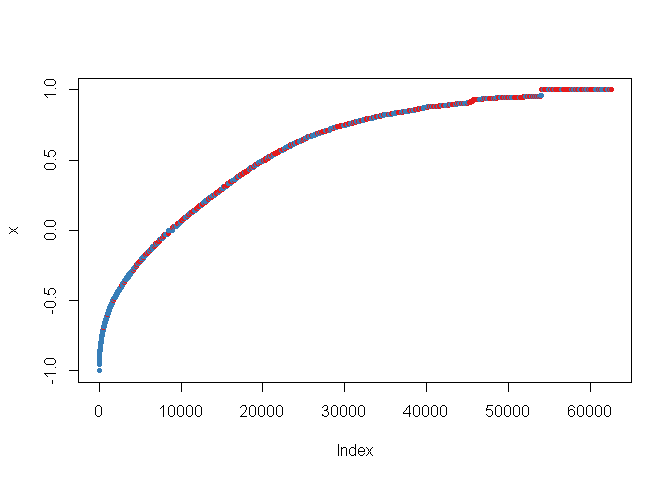
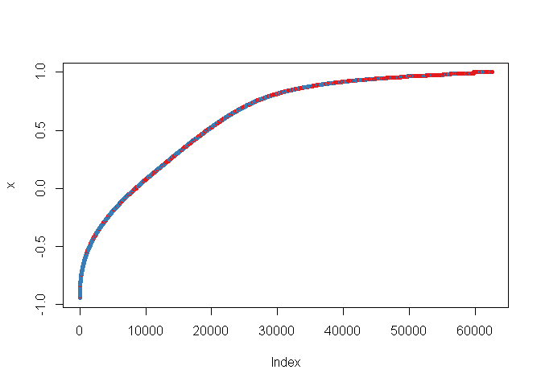

머신러닝 조별 프로젝트
================
오준승-윤휘영-김수현-강민기
2019년 2월 26일

필요 패키지 불러오기 & 작업공간 설정하기
----------------------------------------

``` r
library(tidyverse)
```

    ## -- Attaching packages ----------------- tidyverse 1.2.1 --

    ## √ ggplot2 3.1.0     √ purrr   0.3.0
    ## √ tibble  2.0.1     √ dplyr   0.7.8
    ## √ tidyr   0.8.2     √ stringr 1.4.0
    ## √ readr   1.3.1     √ forcats 0.3.0

    ## -- Conflicts -------------------- tidyverse_conflicts() --
    ## x dplyr::filter() masks stats::filter()
    ## x dplyr::lag()    masks stats::lag()

``` r
library(dplyr)
library(randomForest) # 랜덤포레스트
```

    ## randomForest 4.6-14

    ## Type rfNews() to see new features/changes/bug fixes.

    ## 
    ## Attaching package: 'randomForest'

    ## The following object is masked from 'package:dplyr':
    ## 
    ##     combine

    ## The following object is masked from 'package:ggplot2':
    ## 
    ##     margin

``` r
library(rpart) # 의사결정나무 
library(caret) # 혼동행렬에 필요한 패키지
```

    ## Loading required package: lattice

    ## 
    ## Attaching package: 'caret'

    ## The following object is masked from 'package:purrr':
    ## 
    ##     lift

``` r
library(MLmetrics) # F1 점수에 필요한 패키지
```

    ## 
    ## Attaching package: 'MLmetrics'

    ## The following objects are masked from 'package:caret':
    ## 
    ##     MAE, RMSE

    ## The following object is masked from 'package:base':
    ## 
    ##     Recall

``` r
library(purrr)
library(e1071)
library(xgboost) # xgboost
```

    ## 
    ## Attaching package: 'xgboost'

    ## The following object is masked from 'package:dplyr':
    ## 
    ##     slice

``` r
library(ROCR) # roc 커브에 필요한 패키지
```

    ## Loading required package: gplots

    ## 
    ## Attaching package: 'gplots'

    ## The following object is masked from 'package:stats':
    ## 
    ##     lowess

``` r
library(pROC) # auroc #
```

    ## Type 'citation("pROC")' for a citation.

    ## 
    ## Attaching package: 'pROC'

    ## The following objects are masked from 'package:stats':
    ## 
    ##     cov, smooth, var

``` r
# setwd('') # 작업공간 설정하기
# getwd() # 설정된 작업공간 확인하기
```

``` r
# 레벨을 빈도에 따라 50개로 압축하는 함수
# 인자 : 목표변수(trainset.q$HasDetections), 입력변수(trainset.q[,factor.name[i]])
CompressLevels <- function(object, input, Nlevel = 50){
    
    # factor의 레벨에 따른 목표변수의 0과 1의 빈도를 지역변수에 할당
    detector <- by(object,
                   input,
                   table)
    
    # 레벨 축소를 위해서 임시적으로 character로 변환
    input <- as.character(input)
    
    # 레벨의 수가 50개 이상인 경우
    if(length(detector) > Nlevel){
      
      # 레벨에 따른 백분율을 담을 새로운 객체
      detector.prop.vector <- c()
      
      # 각 레벨에 따른 빈도를 백분율로 전환하기
      for (k in 1:length(detector)) {
        
        detector.prop <- 100 * detector[[k]][1] / (detector[[k]][1] + detector[[k]][2])
        
        detector.prop.vector <- rbind(detector.prop.vector, detector.prop)
        
      }
      
      # cut을 통해서 factor로 전환하기
      detector.prop.factor <- cut(detector.prop.vector,
                                  breaks = seq(from = 0,
                                               to = 100,
                                               by = 100 / Nlevel),
                                  right = FALSE)
      
      # cut을 통해 변환된 factor를 적용하기
      for(k in 1:length(detector)){
        
        # 그 레벨에 해당하는 수들을 전부 그 레벨 값으로 바꾸기
        
        # 백분율이 100이라서, 해당 레벨이 NA값인 경우
        if(is.na(detector.prop.factor[k])){
          
          input[input == names(detector)[k]] <- '[all]'
          
          # 그 외
        }else{
          
          input[input == names(detector)[k]] <- as.character(detector.prop.factor[k])
          
        }
        
      }
      
    }
  
    # 다시 factor로 변환
    input <- as.factor(input)
    
    return(input)
    
}

# 레벨의 이름을 원하는 만큼 잘라주는 함수
CutLevels <- function(data.variable, start, end){
  
  data.variable <- data.variable %>% as.character()
  data.variable <- data.variable %>% str_sub(start = start, 
                                             end = end)
  data.variable <- data.variable %>% as.factor()
  
  return(data.variable)
  
}

# NA를 '미응답'(default)으로 변환하고, factor로 변환해주는 함수
NAtoFactor <- function(data.variable, NA.message = '미응답'){
  
  data.variable <- as.character(data.variable)
  
  data.variable[is.na(data.variable) == TRUE] <- NA.message
  
  data.variable <- as.factor(data.variable)
  
  return(data.variable)
  
}
```

데이터셋 불러오기
=================

``` r
dataset <- read.csv(file = 'trainset_mini.csv',
                    header = TRUE)

# 이름 제거하기
dataset <- dataset[,-1]

# HasDetections : 목표변수. factor로 변환
dataset$HasDetections <- as.factor(dataset$HasDetections)
dataset$HasDetections <- relevel(dataset$HasDetections, ref = '1')
```

1. DataSet<br><br><br>
----------------------

<div style = "color:red">
1.  데이터셋 출처
    </div>
    <https://www.kaggle.com/c/microsoft-malware-prediction>

<br>Kaggle Research Prediction Competition<br>( kaggle에서 주관하는 예측 대회)<br> 실제 데이터는 약 1500만행, 83개의 column을 가지고 있다.<br> 그 중에서 800만행은 목표변수를 포함하여 trainset으로 제공하고 있으며, 나머지 700만행에는 목표변수를 제외하여 testset으로 제공하고 있다.<br><br>목표변수는 HasDetections라는 컬럼으로서, 1과 0으로 이루어져 있기 때문에 우리들의 목적은 이진분류를 통한 악성코드 감염 여부 예측이라고 할 수 있겠다.<br><br> 우리조는 각 조원들의 컴퓨터 여건을 고려하여 trainset 데이터 중에서 **1%만을 sample함수로 추출하여 이것을 다시 0.7:0.3의 비율로 trainset과 validationset**으로 나누어서 예측에 대한 지표들을 확인하기로 하였다.<br><br><br><br>
<div style = "color:red">
1.  데이터셋 구조
    </div>
    **<데이터 변수 설명.hwp 참고>** 각 column의 설명 중 NA로서 마이크로스프트에서 특별한 주석을 제공하지 않은 변수 20개를 포함하여 제품이름(윈도우7~10)과 각종 Identifier들이 존재한다.<br>

**str을 통해 간단하게 확인해본 데이터셋**

``` r
str(dataset) # 데이터셋의 구조
```

    ## 'data.frame':    89155 obs. of  82 variables:
    ##  $ ProductName                                      : Factor w/ 3 levels "mse","mseprerelease",..: 3 3 3 3 3 3 3 3 3 3 ...
    ##  $ EngineVersion                                    : Factor w/ 40 levels "1.1.11701.0",..: 38 36 32 37 38 38 38 27 38 38 ...
    ##  $ AppVersion                                       : Factor w/ 79 levels "4.10.14393.0",..: 39 32 57 39 39 39 39 7 39 39 ...
    ##  $ AvSigVersion                                     : Factor w/ 3856 levels "1.199.1615.0",..: 3743 2684 2177 2922 3808 3340 3591 1834 3672 3557 ...
    ##  $ IsBeta                                           : int  0 0 0 0 0 0 0 0 0 0 ...
    ##  $ RtpStateBitfield                                 : int  7 7 7 7 7 7 7 7 7 7 ...
    ##  $ IsSxsPassiveMode                                 : int  0 0 0 0 0 0 0 0 0 0 ...
    ##  $ DefaultBrowsersIdentifier                        : int  NA NA NA NA NA NA NA NA NA NA ...
    ##  $ AVProductStatesIdentifier                        : int  53447 53447 53447 53447 53447 53447 53447 61100 7945 53447 ...
    ##  $ AVProductsInstalled                              : int  1 1 1 1 1 1 1 2 2 1 ...
    ##  $ AVProductsEnabled                                : int  1 1 1 1 1 1 1 1 1 1 ...
    ##  $ HasTpm                                           : int  1 1 1 1 1 1 1 1 1 1 ...
    ##  $ CountryIdentifier                                : int  108 80 162 89 71 86 214 220 118 97 ...
    ##  $ CityIdentifier                                   : int  75425 7182 22586 113884 26380 165477 58607 115637 156810 89673 ...
    ##  $ OrganizationIdentifier                           : int  27 27 NA NA NA NA 50 NA NA 18 ...
    ##  $ GeoNameIdentifier                                : int  277 101 206 277 89 64 277 237 150 126 ...
    ##  $ LocaleEnglishNameIdentifier                      : int  75 107 232 75 88 49 75 72 140 124 ...
    ##  $ Platform                                         : Factor w/ 4 levels "windows10","windows2016",..: 1 1 1 1 1 1 1 1 1 1 ...
    ##  $ Processor                                        : Factor w/ 3 levels "arm64","x64",..: 2 2 2 3 2 2 2 2 2 2 ...
    ##  $ OsVer                                            : Factor w/ 8 levels "10.0.0.0","10.0.1.0",..: 1 1 1 1 1 1 1 1 1 1 ...
    ##  $ OsBuild                                          : int  17134 17134 10240 15063 17134 17134 17134 14393 17134 17134 ...
    ##  $ OsSuite                                          : int  256 256 768 256 768 256 256 768 768 768 ...
    ##  $ OsPlatformSubRelease                             : Factor w/ 9 levels "prers5","rs1",..: 5 5 6 3 5 5 5 2 5 5 ...
    ##  $ OsBuildLab                                       : Factor w/ 340 levels "10240.16384.amd64fre.th1.150709-1700",..: 193 193 35 184 193 193 193 122 193 193 ...
    ##  $ SkuEdition                                       : Factor w/ 8 levels "Cloud","Education",..: 7 7 5 7 5 7 7 5 5 5 ...
    ##  $ IsProtected                                      : int  1 1 1 1 1 1 1 0 1 1 ...
    ##  $ AutoSampleOptIn                                  : int  0 0 0 0 0 0 0 0 0 0 ...
    ##  $ PuaMode                                          : Factor w/ 2 levels "","on": 1 1 1 1 1 1 1 1 1 1 ...
    ##  $ SMode                                            : int  0 0 0 0 0 0 0 NA 0 0 ...
    ##  $ IeVerIdentifier                                  : int  137 137 53 107 137 137 137 96 137 137 ...
    ##  $ SmartScreen                                      : Factor w/ 11 levels "","&#x02;","Block",..: 1 1 10 1 10 10 10 10 4 10 ...
    ##  $ Firewall                                         : int  1 1 1 1 1 1 1 1 1 1 ...
    ##  $ UacLuaenable                                     : int  1 1 1 1 1 1 1 1 1 1 ...
    ##  $ Census_MDC2FormFactor                            : Factor w/ 11 levels "AllInOne","Convertible",..: 3 8 8 8 8 8 3 8 1 8 ...
    ##  $ Census_DeviceFamily                              : Factor w/ 2 levels "Windows.Desktop",..: 1 1 1 1 1 1 1 1 1 1 ...
    ##  $ Census_OEMNameIdentifier                         : int  2102 2206 2102 585 2206 1443 1443 2668 2668 525 ...
    ##  $ Census_OEMModelIdentifier                        : int  230160 230813 228975 275781 245056 256685 328517 171320 209406 331271 ...
    ##  $ Census_ProcessorCoreCount                        : int  4 2 4 4 4 4 4 2 4 4 ...
    ##  $ Census_ProcessorManufacturerIdentifier           : int  5 5 1 5 5 5 5 5 5 5 ...
    ##  $ Census_ProcessorModelIdentifier                  : int  2719 4337 288 2373 2574 3063 2385 1998 2574 2329 ...
    ##  $ Census_ProcessorClass                            : Factor w/ 4 levels "","high","low",..: 1 1 1 1 1 1 1 1 1 1 ...
    ##  $ Census_PrimaryDiskTotalCapacity                  : num  953869 476940 476940 476940 953869 ...
    ##  $ Census_PrimaryDiskTypeName                       : Factor w/ 5 levels "","HDD","SSD",..: 2 2 2 2 2 3 2 2 2 3 ...
    ##  $ Census_SystemVolumeTotalCapacity                 : int  952908 435813 456680 99500 928718 243631 105655 432777 926980 113108 ...
    ##  $ Census_HasOpticalDiskDrive                       : int  0 0 0 0 0 0 0 0 0 1 ...
    ##  $ Census_TotalPhysicalRAM                          : int  8192 6144 4096 2048 6144 8192 4096 2048 4096 4096 ...
    ##  $ Census_ChassisTypeName                           : Factor w/ 25 levels "","30","AllinOne",..: 6 15 15 15 15 9 6 15 6 15 ...
    ##  $ Census_InternalPrimaryDiagonalDisplaySizeInInches: num  23.5 15.5 15.5 16.3 17.3 15.5 18.5 15.5 23.5 15.6 ...
    ##  $ Census_InternalPrimaryDisplayResolutionHorizontal: int  1920 1366 1366 1366 1600 1920 1366 1366 1920 1366 ...
    ##  $ Census_InternalPrimaryDisplayResolutionVertical  : int  1080 768 768 768 900 1080 768 768 1080 768 ...
    ##  $ Census_PowerPlatformRoleName                     : Factor w/ 10 levels "","AppliancePC",..: 3 5 5 5 5 5 3 5 3 5 ...
    ##  $ Census_InternalBatteryType                       : Factor w/ 19 levels "","#","batt",..: 1 1 11 1 1 1 2 1 1 11 ...
    ##  $ Census_InternalBatteryNumberOfCharges            : num  4.29e+09 0.00 2.52e+02 0.00 0.00 ...
    ##  $ Census_OSVersion                                 : Factor w/ 255 levels "10.0.10240.16384",..: 217 212 31 169 217 217 217 94 217 214 ...
    ##  $ Census_OSArchitecture                            : Factor w/ 3 levels "amd64","arm64",..: 1 1 1 3 1 1 1 1 1 1 ...
    ##  $ Census_OSBranch                                  : Factor w/ 13 levels "rs_prerelease",..: 8 8 11 4 8 8 8 3 8 8 ...
    ##  $ Census_OSBuildNumber                             : int  17134 17134 10240 15063 17134 17134 17134 14393 17134 17134 ...
    ##  $ Census_OSBuildRevision                           : int  228 112 17443 674 228 228 228 1884 228 165 ...
    ##  $ Census_OSEdition                                 : Factor w/ 20 levels "Cloud","Core",..: 12 12 2 12 2 12 12 5 2 2 ...
    ##  $ Census_OSSkuName                                 : Factor w/ 18 levels "CLOUD","CORE",..: 13 13 2 13 2 13 13 5 2 2 ...
    ##  $ Census_OSInstallTypeName                         : Factor w/ 9 levels "Clean","CleanPCRefresh",..: 9 9 4 3 5 9 7 4 9 9 ...
    ##  $ Census_OSInstallLanguageIdentifier               : int  8 6 8 8 14 8 8 8 5 18 ...
    ##  $ Census_OSUILocaleIdentifier                      : int  31 28 31 31 49 31 31 31 90 72 ...
    ##  $ Census_OSWUAutoUpdateOptionsName                 : Factor w/ 6 levels "AutoInstallAndRebootAtMaintenanceTime",..: 3 6 6 6 3 3 3 4 3 3 ...
    ##  $ Census_IsPortableOperatingSystem                 : int  0 0 0 0 0 0 0 0 0 0 ...
    ##  $ Census_GenuineStateName                          : Factor w/ 4 levels "INVALID_LICENSE",..: 2 2 2 1 2 2 2 2 2 2 ...
    ##  $ Census_ActivationChannel                         : Factor w/ 6 levels "OEM:DM","OEM:NONSLP",..: 3 3 1 3 3 2 5 1 3 2 ...
    ##  $ Census_IsFlightingInternal                       : int  NA NA 0 NA NA NA 0 NA 0 0 ...
    ##  $ Census_IsFlightsDisabled                         : int  0 0 0 0 0 0 0 0 0 0 ...
    ##  $ Census_FlightRing                                : Factor w/ 7 levels "Disabled","NOT_SET",..: 3 3 2 3 3 3 3 3 3 3 ...
    ##  $ Census_ThresholdOptIn                            : int  NA NA 0 NA NA NA 0 NA 0 0 ...
    ##  $ Census_FirmwareManufacturerIdentifier            : int  93 500 142 142 554 355 355 628 628 142 ...
    ##  $ Census_FirmwareVersionIdentifier                 : int  2482 15244 33137 7391 33066 4319 10816 8791 49998 70262 ...
    ##  $ Census_IsSecureBootEnabled                       : int  0 0 1 0 1 1 1 1 1 1 ...
    ##  $ Census_IsWIMBootEnabled                          : int  NA NA 0 NA NA NA 0 NA 0 0 ...
    ##  $ Census_IsVirtualDevice                           : int  0 0 0 0 0 0 0 0 0 0 ...
    ##  $ Census_IsTouchEnabled                            : int  0 0 1 0 0 0 0 0 0 0 ...
    ##  $ Census_IsPenCapable                              : int  0 0 0 0 0 0 0 0 0 0 ...
    ##  $ Census_IsAlwaysOnAlwaysConnectedCapable          : int  0 0 0 0 0 0 0 0 0 0 ...
    ##  $ Wdft_IsGamer                                     : int  1 0 0 0 0 0 0 1 1 0 ...
    ##  $ Wdft_RegionIdentifier                            : int  11 3 10 1 10 3 1 11 3 15 ...
    ##  $ HasDetections                                    : Factor w/ 2 levels "1","0": 2 2 1 2 1 2 1 2 1 2 ...

<br><br> **1%로 샘플링한 데이터셋의 길이**

``` r
nrow(dataset) # 89155개
```

    ## [1] 89155

<br><br> **1%로 샘플링한 데이터셋의 목표변수의 1과 0의 비율**

``` r
dataset$HasDetections %>% table() %>% prop.table()
```

    ## .
    ##         1         0 
    ## 0.4984914 0.5015086

<br><br> **각 변수별 NA값 확인하기**

``` r
sapply(dataset, function(x) sum(is.na(x)))
```

    ##                                       ProductName 
    ##                                                 0 
    ##                                     EngineVersion 
    ##                                                 0 
    ##                                        AppVersion 
    ##                                                 0 
    ##                                      AvSigVersion 
    ##                                                 0 
    ##                                            IsBeta 
    ##                                                 0 
    ##                                  RtpStateBitfield 
    ##                                               316 
    ##                                  IsSxsPassiveMode 
    ##                                                 0 
    ##                         DefaultBrowsersIdentifier 
    ##                                             84695 
    ##                         AVProductStatesIdentifier 
    ##                                               350 
    ##                               AVProductsInstalled 
    ##                                               350 
    ##                                 AVProductsEnabled 
    ##                                               350 
    ##                                            HasTpm 
    ##                                                 0 
    ##                                 CountryIdentifier 
    ##                                                 0 
    ##                                    CityIdentifier 
    ##                                              3277 
    ##                            OrganizationIdentifier 
    ##                                             27540 
    ##                                 GeoNameIdentifier 
    ##                                                 2 
    ##                       LocaleEnglishNameIdentifier 
    ##                                                 0 
    ##                                          Platform 
    ##                                                 0 
    ##                                         Processor 
    ##                                                 0 
    ##                                             OsVer 
    ##                                                 0 
    ##                                           OsBuild 
    ##                                                 0 
    ##                                           OsSuite 
    ##                                                 0 
    ##                              OsPlatformSubRelease 
    ##                                                 0 
    ##                                        OsBuildLab 
    ##                                                 0 
    ##                                        SkuEdition 
    ##                                                 0 
    ##                                       IsProtected 
    ##                                               349 
    ##                                   AutoSampleOptIn 
    ##                                                 0 
    ##                                           PuaMode 
    ##                                                 0 
    ##                                             SMode 
    ##                                              5462 
    ##                                   IeVerIdentifier 
    ##                                               592 
    ##                                       SmartScreen 
    ##                                                 0 
    ##                                          Firewall 
    ##                                               942 
    ##                                      UacLuaenable 
    ##                                               100 
    ##                             Census_MDC2FormFactor 
    ##                                                 0 
    ##                               Census_DeviceFamily 
    ##                                                 0 
    ##                          Census_OEMNameIdentifier 
    ##                                               974 
    ##                         Census_OEMModelIdentifier 
    ##                                              1048 
    ##                         Census_ProcessorCoreCount 
    ##                                               441 
    ##            Census_ProcessorManufacturerIdentifier 
    ##                                               441 
    ##                   Census_ProcessorModelIdentifier 
    ##                                               443 
    ##                             Census_ProcessorClass 
    ##                                                 0 
    ##                   Census_PrimaryDiskTotalCapacity 
    ##                                               556 
    ##                        Census_PrimaryDiskTypeName 
    ##                                                 0 
    ##                  Census_SystemVolumeTotalCapacity 
    ##                                               556 
    ##                        Census_HasOpticalDiskDrive 
    ##                                                 0 
    ##                           Census_TotalPhysicalRAM 
    ##                                               807 
    ##                            Census_ChassisTypeName 
    ##                                                 0 
    ## Census_InternalPrimaryDiagonalDisplaySizeInInches 
    ##                                               474 
    ## Census_InternalPrimaryDisplayResolutionHorizontal 
    ##                                               473 
    ##   Census_InternalPrimaryDisplayResolutionVertical 
    ##                                               473 
    ##                      Census_PowerPlatformRoleName 
    ##                                                 0 
    ##                        Census_InternalBatteryType 
    ##                                                 0 
    ##             Census_InternalBatteryNumberOfCharges 
    ##                                              2716 
    ##                                  Census_OSVersion 
    ##                                                 0 
    ##                             Census_OSArchitecture 
    ##                                                 0 
    ##                                   Census_OSBranch 
    ##                                                 0 
    ##                              Census_OSBuildNumber 
    ##                                                 0 
    ##                            Census_OSBuildRevision 
    ##                                                 0 
    ##                                  Census_OSEdition 
    ##                                                 0 
    ##                                  Census_OSSkuName 
    ##                                                 0 
    ##                          Census_OSInstallTypeName 
    ##                                                 0 
    ##                Census_OSInstallLanguageIdentifier 
    ##                                               605 
    ##                       Census_OSUILocaleIdentifier 
    ##                                                 0 
    ##                  Census_OSWUAutoUpdateOptionsName 
    ##                                                 0 
    ##                  Census_IsPortableOperatingSystem 
    ##                                                 0 
    ##                           Census_GenuineStateName 
    ##                                                 0 
    ##                          Census_ActivationChannel 
    ##                                                 0 
    ##                        Census_IsFlightingInternal 
    ##                                             74154 
    ##                          Census_IsFlightsDisabled 
    ##                                              1600 
    ##                                 Census_FlightRing 
    ##                                                 0 
    ##                             Census_ThresholdOptIn 
    ##                                             56761 
    ##             Census_FirmwareManufacturerIdentifier 
    ##                                              1789 
    ##                  Census_FirmwareVersionIdentifier 
    ##                                              1587 
    ##                        Census_IsSecureBootEnabled 
    ##                                                 0 
    ##                           Census_IsWIMBootEnabled 
    ##                                             56686 
    ##                            Census_IsVirtualDevice 
    ##                                               166 
    ##                             Census_IsTouchEnabled 
    ##                                                 0 
    ##                               Census_IsPenCapable 
    ##                                                 0 
    ##           Census_IsAlwaysOnAlwaysConnectedCapable 
    ##                                               754 
    ##                                      Wdft_IsGamer 
    ##                                              3090 
    ##                             Wdft_RegionIdentifier 
    ##                                              3090 
    ##                                     HasDetections 
    ##                                                 0

<br><br> 전처리 하기에 앞서서, NA가 있어도 자동으로 처리해줄 수 있는 모형이 있고, NA가 없어야만 하는 모형도 있다.<br>여러가지 모형들의 성능을 평가하기 위해서는 NA는 어떻게든 처리해주는 편이 좋을 것 같다.<br> 실제로 어떤 IT기업이 소비자들의 악성코드 감염 여부를 예측할 때, 모든 데이터를 전부 조사하기는 힘들 것이다.<br> 컴퓨터에 일가견이 있는 사람들을 제외한 대다수에 사람들이 자신의 컴퓨터에 대해서 잘 알지 못하며, 옵션들을 함부로 건들이기를 꺼려한다. 또한, 실제로 사용자들을 대상으로 악성코드에 대한 예측을 하고자할 때, **기업이 미쳐 확인하지 못한 것들이 있을 것이다. 이것들을 모두 고려하여 최대한 정확한 예측을 하는 모형이 기업이 원하는 모형일 것이다.** 따라서 NA라고 삭제해버리는 것은 안 좋은 선택일수도 있다.<br><br> 우리조에서 생각해볼 NA 전처리문제 해결법<br> 1. 보류한다.<br> 2. 모두 제거한다.<br> **3. 제 3의 범주로 만든다. ( 범주형으로 만들어서 해결하기 )**<br> **4. 대체값을 찾는다. (단, int형으로 만들 수 있는 변수들만)**<br> 5. 기타 방법<br><br><br> 위에서 말했듯이, 1번의 NA를 단순히 보류하는 것은 데이터 낭비일 수도 있다. 그리고 2번의 NA를 모두 제거하는 것은 사실상 NA를 보류하는 것과 같은 말이다. 그리고 우리가 정말 고려해야할 방법은 3번과 4번일 것이다.<br> 5번의 경우는, 일단 모형을 만들어보고, 각 변수들 중 중요도가 높은 것들을 중심으로 전처리하는 방식 등이 있을 것이다. 이 방식들은 이 프로젝트가 끝난 후에 개인적으로 만들어볼 생각이다.<br><br><br><br>

2. 전처리 하기 전의 데이터셋 의사결정나무<br>
---------------------------------------------

전처리를 하지 않은 상태에서 만든 모형은 아마도 NA를 모두 제거한 상태와 같을 것이다. 위에서 해결법 1번과 2번에 해당하는 방식일 것이다.<br><br>

\*\* dataset을 trainset과 validationset으로 나누기\*\*

``` r
set.seed(123)

index <- sample(1:2,
                size = nrow(dataset),
                prob = c(0.7,0.3),
                replace = TRUE)

# t은 trainset, v는 validationset이다.
# 현재 testset의 목표변수를 알 수 없으므로, 어쩔 수 없이 dataset을 q1과 q2로 분리하여 예측률을 확인하도록 한다.
dataset.t <- dataset[index == 1, ]
dataset.v <- dataset[index == 2, ]
```

<br><br> \*\* 의사결정나무 모형 적합해보기\*\*

``` r
fitTree <- rpart(HasDetections ~.,
                 data = dataset.t,
                 method = 'class',
                 parms = list(split = 'gini'),
                 control = rpart.control(minsplit = 20,
                                         cp = 0.01,
                                         maxdepth = 10))

trPred <- predict(fitTree,
                  newdata = dataset.v,
                  type = 'class')

trReal <- dataset.v$HasDetections

confusionMatrix(trPred, trReal, positive = '1')
```

    ## Confusion Matrix and Statistics
    ## 
    ##           Reference
    ## Prediction    1    0
    ##          1 8496 6430
    ##          0 4818 6872
    ##                                           
    ##                Accuracy : 0.5774          
    ##                  95% CI : (0.5714, 0.5833)
    ##     No Information Rate : 0.5002          
    ##     P-Value [Acc > NIR] : < 2.2e-16       
    ##                                           
    ##                   Kappa : 0.1547          
    ##  Mcnemar's Test P-Value : < 2.2e-16       
    ##                                           
    ##             Sensitivity : 0.6381          
    ##             Specificity : 0.5166          
    ##          Pos Pred Value : 0.5692          
    ##          Neg Pred Value : 0.5879          
    ##              Prevalence : 0.5002          
    ##          Detection Rate : 0.3192          
    ##    Detection Prevalence : 0.5608          
    ##       Balanced Accuracy : 0.5774          
    ##                                           
    ##        'Positive' Class : 1               
    ## 

``` r
F1_Score(trPred, trReal)
```

    ## [1] 0.6016997

<br><br> **랜덤포레스트 모형 적합해보기**

``` r
# AvSigVersion
# AppVersion
# OsBuildLab
# Census_OSVersion

# 임시방편으로 레벨의 수가 많은 column을 제거하고 랜덤포레스트 모형에 적합하였다.

dataset.t.i <- dplyr::select(dataset.t,-c(AvSigVersion,
                                          AppVersion,
                                          OsBuildLab,
                                          Census_OSVersion))

dataset.v.i <- dplyr::select(dataset.v,-c(AvSigVersion,
                                          AppVersion,
                                          OsBuildLab,
                                          Census_OSVersion))

fitRFC <- randomForest(x = dataset.t.i[complete.cases(dataset.t.i),
                                       -78],
                       y = dataset.t.i[complete.cases(dataset.t.i),
                                       78],
                       ntree = 100,
                       mtry = 10,
                       importance = TRUE,
                       do.trace = 50,
                       keep.forest = TRUE)
```

    ## ntree      OOB      1      2
    ##    50:  27.91% 30.00% 26.09%
    ##   100:  27.91% 32.50% 23.91%

``` r
trPred <- predict(fitRFC, dataset.v.i[complete.cases(dataset.v.i),],
                  type = 'response')
trReal <- dataset.v.i[complete.cases(dataset.v.i),78]

confusionMatrix(trPred, trReal, positive = '1')
```

    ## Confusion Matrix and Statistics
    ## 
    ##           Reference
    ## Prediction  1  0
    ##          1  6  4
    ##          0 13 15
    ##                                          
    ##                Accuracy : 0.5526         
    ##                  95% CI : (0.383, 0.7138)
    ##     No Information Rate : 0.5            
    ##     P-Value [Acc > NIR] : 0.31355        
    ##                                          
    ##                   Kappa : 0.1053         
    ##  Mcnemar's Test P-Value : 0.05235        
    ##                                          
    ##             Sensitivity : 0.3158         
    ##             Specificity : 0.7895         
    ##          Pos Pred Value : 0.6000         
    ##          Neg Pred Value : 0.5357         
    ##              Prevalence : 0.5000         
    ##          Detection Rate : 0.1579         
    ##    Detection Prevalence : 0.2632         
    ##       Balanced Accuracy : 0.5526         
    ##                                          
    ##        'Positive' Class : 1              
    ## 

``` r
F1_Score(trPred, trReal)
```

    ## [1] 0.4137931

<br><br> 의사결정나무 보다도 상당히 낮은 민감도를 보이며, NA값들을 제거하고 보니, 남은 행들이 거의 없다시피 하였다. 따라서 전처리를 통해서, NA값을 범주로 만들거나, 특정 변수들을 int형으로 변환한 후, NA값을 대체값으로 대체하는 방법을 사용하기로 하였다.<br><br><br><br>

3. NA값이 있는 변수들을 범주형으로 전처리하기
---------------------------------------------

<br><br> 위에서 보았듯이, NA값을 전처리하지 않고, 그대로 사용한다면 좋은 예측 모형을 기대하기 어려울 것 같다. 그냥 50%확률로 찍어서 예측하는 것과 비슷한 정도이다.<br>**또한, 데이터를 확인하는 과정에서 NA값에 의미가 있는 경우를 확인하였다.** 예를 들자면, 변수 **IsProtected**의 경우에는 1일 때는 백신을 실행 중, 0일 때는 업데이트를 하지 않은 백신을 실행 중, **NA일 경우 백신을 사용하지 않는다.** 라는 의미가 된다.<br><br>따라서 NA를 범주로 처리해보기로 하였다.<br><br>

``` r
# 전처리할 데이터셋
dataset.q <- dataset
```

**버전을 담고 있는 factor**

``` r
# 버전을 담고 있는 factor
factor.name <- c('EngineVersion',
                 'AppVersion',
                 'AvSigVersion',
                 'Census_OSVersion')

factor.cutnum <- c(6,7,4,7)

for(i in 1:4){
  
  dataset.q[,factor.name[i]] <- CutLevels(dataset.q[,factor.name[i]],
                                           start = 1,
                                           end = factor.cutnum[i])
  
}
```

<br><br> **""라는 이름의 레벨을 가진 factor에 대해서 '미응답'으로 이름 바꾸기**

``` r
# "" 가 포함된 factor를 '미응답'으로 바꾸기
factor.name <- c('Census_PrimaryDiskTypeName',
                 'Census_ChassisTypeName',
                 'Census_PowerPlatformRoleName')

for(i in 1:3){
  
  dataset.q[,factor.name[i]] <- as.character(dataset.q[,factor.name[i]])
  dataset.q[,factor.name[i]] <- ifelse(dataset.q[,factor.name[i]] == "", yes = "미응답", dataset.q[,factor.name[i]])
  dataset.q[,factor.name[i]] <- as.factor(dataset.q[,factor.name[i]])
  
}
```

<br><br> **NA값이 대다수인 변수**

``` r
# NA값이 대다수인 변수
factor.name <- c('DefaultBrowsersIdentifier',
                 'OrganizationIdentifier',
                 'Census_IsFlightingInternal',
                 'Census_ThresholdOptIn')

for(i in 1:length(factor.name)){
  
  dataset.q[,factor.name[i]] <- NAtoFactor(dataset.q[,factor.name[i]])
  
}
```

<br><br> **기타 변수**

``` r
# 기타 변수
factor.name <- c('IsBeta',
                 'IsSxsPassiveMode',
                 'AVProductStatesIdentifier',
                 'HasTpm',
                 'CountryIdentifier',
                 'CityIdentifier',
                 'GeoNameIdentifier',
                 'LocaleEnglishNameIdentifier',
                 'OsSuite',
                 'OsBuild',
                 'IsProtected',
                 'Census_HasOpticalDiskDrive',
                 'Census_OSBuildNumber',
                 'Census_OSBuildRevision',
                 'Census_OSInstallLanguageIdentifier',
                 'Census_OSUILocaleIdentifier',
                 'Census_IsPortableOperatingSystem',
                 'Census_IsFlightsDisabled',
                 'Census_FirmwareManufacturerIdentifier',
                 'Census_FirmwareVersionIdentifier',
                 'Census_IsSecureBootEnabled',
                 'Census_IsWIMBootEnabled',
                 'Census_IsVirtualDevice',
                 'Census_IsTouchEnabled',
                 'Census_IsPenCapable',
                 'Census_IsAlwaysOnAlwaysConnectedCapable',
                 'Wdft_IsGamer',
                 'Wdft_RegionIdentifier',
                 'AutoSampleOptIn',
                 'SMode',
                 'IeVerIdentifier',
                 'Firewall',
                 'UacLuaenable',
                 'Census_OEMNameIdentifier',
                 'Census_OEMModelIdentifier',
                 'Census_ProcessorManufacturerIdentifier',
                 'RtpStateBitfield',
                 'AVProductsInstalled',
                 'AVProductsEnabled',
                 'Census_ProcessorModelIdentifier',
                 'Census_InternalBatteryNumberOfCharges')

for(i in 1:length(factor.name)){
  
  dataset.q[,factor.name[i]] <- NAtoFactor(dataset.q[,factor.name[i]])
  
}
```

<br><br> **수치형, 혹은 범주형으로 전환할 수 있는 변수**<br> 이 변수들의 경우에는 2가지 모두 사용해서 확인해본다.

``` r
# int형으로 그대로 사용할 수 있고, 혹은 범주형으로 전환할 수 있는 변수
# 이 변수의 경우 2가지를 모두해서 확인해본다.

# 범주형으로 전환할 데이터셋
dataset.q.1 <- dataset.q
# int형 그대로 사용할 데이터셋
dataset.q.2 <- dataset.q


factor.name <- c('Census_ProcessorCoreCount',
                 'Census_PrimaryDiskTotalCapacity',
                 'Census_SystemVolumeTotalCapacity',
                 'Census_TotalPhysicalRAM',
                 'Census_InternalPrimaryDiagonalDisplaySizeInInches',
                 'Census_InternalPrimaryDisplayResolutionHorizontal',
                 'Census_InternalPrimaryDisplayResolutionVertical')


# (1) NA처리하고, 범주형으로 변환하기
for(i in 1:length(factor.name)){
  
  dataset.q.1[,factor.name[i]] <- NAtoFactor(dataset.q.1[,factor.name[i]])
  
}

# (2) NA를 대체값으로 대체하기
for(i in 1:length(factor.name)){

  dataset.q.2[is.na(dataset.q.2[,factor.name[i]]),
              factor.name[i]] <- summary(dataset.q.2[,factor.name[i]])[3]

}
```

<br><br> **전처리된 데이터셋 1번의 NA와 레벨수 확인하기**

``` r
# NA값과 레벨수 확인하기
factor.name <- colnames(dataset.q.1)

for(i in 1:length(factor.name)){
  
  cat('변수명 : ', factor.name[i], "\n")
  cat('NA : ', naniar::n_miss(dataset.q.1[,factor.name[i]]), '\n')
  cat('레벨수 : ', nlevels(dataset.q.1[,factor.name[i]]), 
      '\n\n')
  
}
```

    ## 변수명 :  ProductName 
    ## NA :  0 
    ## 레벨수 :  3 
    ## 
    ## 변수명 :  EngineVersion 
    ## NA :  0 
    ## 레벨수 :  5 
    ## 
    ## 변수명 :  AppVersion 
    ## NA :  0 
    ## 레벨수 :  22 
    ## 
    ## 변수명 :  AvSigVersion 
    ## NA :  0 
    ## 레벨수 :  7 
    ## 
    ## 변수명 :  IsBeta 
    ## NA :  0 
    ## 레벨수 :  2 
    ## 
    ## 변수명 :  RtpStateBitfield 
    ## NA :  0 
    ## 레벨수 :  7 
    ## 
    ## 변수명 :  IsSxsPassiveMode 
    ## NA :  0 
    ## 레벨수 :  2 
    ## 
    ## 변수명 :  DefaultBrowsersIdentifier 
    ## NA :  0 
    ## 레벨수 :  256 
    ## 
    ## 변수명 :  AVProductStatesIdentifier 
    ## NA :  0 
    ## 레벨수 :  1957 
    ## 
    ## 변수명 :  AVProductsInstalled 
    ## NA :  0 
    ## 레벨수 :  6 
    ## 
    ## 변수명 :  AVProductsEnabled 
    ## NA :  0 
    ## 레벨수 :  6 
    ## 
    ## 변수명 :  HasTpm 
    ## NA :  0 
    ## 레벨수 :  2 
    ## 
    ## 변수명 :  CountryIdentifier 
    ## NA :  0 
    ## 레벨수 :  219 
    ## 
    ## 변수명 :  CityIdentifier 
    ## NA :  0 
    ## 레벨수 :  14804 
    ## 
    ## 변수명 :  OrganizationIdentifier 
    ## NA :  0 
    ## 레벨수 :  38 
    ## 
    ## 변수명 :  GeoNameIdentifier 
    ## NA :  0 
    ## 레벨수 :  241 
    ## 
    ## 변수명 :  LocaleEnglishNameIdentifier 
    ## NA :  0 
    ## 레벨수 :  186 
    ## 
    ## 변수명 :  Platform 
    ## NA :  0 
    ## 레벨수 :  4 
    ## 
    ## 변수명 :  Processor 
    ## NA :  0 
    ## 레벨수 :  3 
    ## 
    ## 변수명 :  OsVer 
    ## NA :  0 
    ## 레벨수 :  8 
    ## 
    ## 변수명 :  OsBuild 
    ## NA :  0 
    ## 레벨수 :  35 
    ## 
    ## 변수명 :  OsSuite 
    ## NA :  0 
    ## 레벨수 :  6 
    ## 
    ## 변수명 :  OsPlatformSubRelease 
    ## NA :  0 
    ## 레벨수 :  9 
    ## 
    ## 변수명 :  OsBuildLab 
    ## NA :  0 
    ## 레벨수 :  340 
    ## 
    ## 변수명 :  SkuEdition 
    ## NA :  0 
    ## 레벨수 :  8 
    ## 
    ## 변수명 :  IsProtected 
    ## NA :  0 
    ## 레벨수 :  3 
    ## 
    ## 변수명 :  AutoSampleOptIn 
    ## NA :  0 
    ## 레벨수 :  2 
    ## 
    ## 변수명 :  PuaMode 
    ## NA :  0 
    ## 레벨수 :  2 
    ## 
    ## 변수명 :  SMode 
    ## NA :  0 
    ## 레벨수 :  3 
    ## 
    ## 변수명 :  IeVerIdentifier 
    ## NA :  0 
    ## 레벨수 :  143 
    ## 
    ## 변수명 :  SmartScreen 
    ## NA :  0 
    ## 레벨수 :  11 
    ## 
    ## 변수명 :  Firewall 
    ## NA :  0 
    ## 레벨수 :  3 
    ## 
    ## 변수명 :  UacLuaenable 
    ## NA :  0 
    ## 레벨수 :  4 
    ## 
    ## 변수명 :  Census_MDC2FormFactor 
    ## NA :  0 
    ## 레벨수 :  11 
    ## 
    ## 변수명 :  Census_DeviceFamily 
    ## NA :  0 
    ## 레벨수 :  2 
    ## 
    ## 변수명 :  Census_OEMNameIdentifier 
    ## NA :  0 
    ## 레벨수 :  818 
    ## 
    ## 변수명 :  Census_OEMModelIdentifier 
    ## NA :  0 
    ## 레벨수 :  15125 
    ## 
    ## 변수명 :  Census_ProcessorCoreCount 
    ## NA :  0 
    ## 레벨수 :  20 
    ## 
    ## 변수명 :  Census_ProcessorManufacturerIdentifier 
    ## NA :  0 
    ## 레벨수 :  5 
    ## 
    ## 변수명 :  Census_ProcessorModelIdentifier 
    ## NA :  0 
    ## 레벨수 :  1694 
    ## 
    ## 변수명 :  Census_ProcessorClass 
    ## NA :  0 
    ## 레벨수 :  4 
    ## 
    ## 변수명 :  Census_PrimaryDiskTotalCapacity 
    ## NA :  0 
    ## 레벨수 :  452 
    ## 
    ## 변수명 :  Census_PrimaryDiskTypeName 
    ## NA :  0 
    ## 레벨수 :  5 
    ## 
    ## 변수명 :  Census_SystemVolumeTotalCapacity 
    ## NA :  0 
    ## 레벨수 :  41874 
    ## 
    ## 변수명 :  Census_HasOpticalDiskDrive 
    ## NA :  0 
    ## 레벨수 :  2 
    ## 
    ## 변수명 :  Census_TotalPhysicalRAM 
    ## NA :  0 
    ## 레벨수 :  169 
    ## 
    ## 변수명 :  Census_ChassisTypeName 
    ## NA :  0 
    ## 레벨수 :  25 
    ## 
    ## 변수명 :  Census_InternalPrimaryDiagonalDisplaySizeInInches 
    ## NA :  0 
    ## 레벨수 :  350 
    ## 
    ## 변수명 :  Census_InternalPrimaryDisplayResolutionHorizontal 
    ## NA :  0 
    ## 레벨수 :  141 
    ## 
    ## 변수명 :  Census_InternalPrimaryDisplayResolutionVertical 
    ## NA :  0 
    ## 레벨수 :  161 
    ## 
    ## 변수명 :  Census_PowerPlatformRoleName 
    ## NA :  0 
    ## 레벨수 :  10 
    ## 
    ## 변수명 :  Census_InternalBatteryType 
    ## NA :  0 
    ## 레벨수 :  19 
    ## 
    ## 변수명 :  Census_InternalBatteryNumberOfCharges 
    ## NA :  0 
    ## 레벨수 :  1585 
    ## 
    ## 변수명 :  Census_OSVersion 
    ## NA :  0 
    ## 레벨수 :  7 
    ## 
    ## 변수명 :  Census_OSArchitecture 
    ## NA :  0 
    ## 레벨수 :  3 
    ## 
    ## 변수명 :  Census_OSBranch 
    ## NA :  0 
    ## 레벨수 :  13 
    ## 
    ## 변수명 :  Census_OSBuildNumber 
    ## NA :  0 
    ## 레벨수 :  37 
    ## 
    ## 변수명 :  Census_OSBuildRevision 
    ## NA :  0 
    ## 레벨수 :  214 
    ## 
    ## 변수명 :  Census_OSEdition 
    ## NA :  0 
    ## 레벨수 :  20 
    ## 
    ## 변수명 :  Census_OSSkuName 
    ## NA :  0 
    ## 레벨수 :  18 
    ## 
    ## 변수명 :  Census_OSInstallTypeName 
    ## NA :  0 
    ## 레벨수 :  9 
    ## 
    ## 변수명 :  Census_OSInstallLanguageIdentifier 
    ## NA :  0 
    ## 레벨수 :  40 
    ## 
    ## 변수명 :  Census_OSUILocaleIdentifier 
    ## NA :  0 
    ## 레벨수 :  63 
    ## 
    ## 변수명 :  Census_OSWUAutoUpdateOptionsName 
    ## NA :  0 
    ## 레벨수 :  6 
    ## 
    ## 변수명 :  Census_IsPortableOperatingSystem 
    ## NA :  0 
    ## 레벨수 :  2 
    ## 
    ## 변수명 :  Census_GenuineStateName 
    ## NA :  0 
    ## 레벨수 :  4 
    ## 
    ## 변수명 :  Census_ActivationChannel 
    ## NA :  0 
    ## 레벨수 :  6 
    ## 
    ## 변수명 :  Census_IsFlightingInternal 
    ## NA :  0 
    ## 레벨수 :  2 
    ## 
    ## 변수명 :  Census_IsFlightsDisabled 
    ## NA :  0 
    ## 레벨수 :  3 
    ## 
    ## 변수명 :  Census_FlightRing 
    ## NA :  0 
    ## 레벨수 :  7 
    ## 
    ## 변수명 :  Census_ThresholdOptIn 
    ## NA :  0 
    ## 레벨수 :  3 
    ## 
    ## 변수명 :  Census_FirmwareManufacturerIdentifier 
    ## NA :  0 
    ## 레벨수 :  160 
    ## 
    ## 변수명 :  Census_FirmwareVersionIdentifier 
    ## NA :  0 
    ## 레벨수 :  11808 
    ## 
    ## 변수명 :  Census_IsSecureBootEnabled 
    ## NA :  0 
    ## 레벨수 :  2 
    ## 
    ## 변수명 :  Census_IsWIMBootEnabled 
    ## NA :  0 
    ## 레벨수 :  2 
    ## 
    ## 변수명 :  Census_IsVirtualDevice 
    ## NA :  0 
    ## 레벨수 :  3 
    ## 
    ## 변수명 :  Census_IsTouchEnabled 
    ## NA :  0 
    ## 레벨수 :  2 
    ## 
    ## 변수명 :  Census_IsPenCapable 
    ## NA :  0 
    ## 레벨수 :  2 
    ## 
    ## 변수명 :  Census_IsAlwaysOnAlwaysConnectedCapable 
    ## NA :  0 
    ## 레벨수 :  3 
    ## 
    ## 변수명 :  Wdft_IsGamer 
    ## NA :  0 
    ## 레벨수 :  3 
    ## 
    ## 변수명 :  Wdft_RegionIdentifier 
    ## NA :  0 
    ## 레벨수 :  16 
    ## 
    ## 변수명 :  HasDetections 
    ## NA :  0 
    ## 레벨수 :  2

<br><br> **전처리된 데이터셋 2번의 NA와 레벨수 확인하기**

``` r
# NA값과 레벨수 확인하기
factor.name <- colnames(dataset.q.2)

for(i in 1:length(factor.name)){
  
  cat('변수명 : ', factor.name[i], "\n")
  cat('NA : ', naniar::n_miss(dataset.q.2[,factor.name[i]]), '\n')
  cat('레벨수 : ', nlevels(dataset.q.2[,factor.name[i]]), 
      '\n\n')
  
}
```

    ## 변수명 :  ProductName 
    ## NA :  0 
    ## 레벨수 :  3 
    ## 
    ## 변수명 :  EngineVersion 
    ## NA :  0 
    ## 레벨수 :  5 
    ## 
    ## 변수명 :  AppVersion 
    ## NA :  0 
    ## 레벨수 :  22 
    ## 
    ## 변수명 :  AvSigVersion 
    ## NA :  0 
    ## 레벨수 :  7 
    ## 
    ## 변수명 :  IsBeta 
    ## NA :  0 
    ## 레벨수 :  2 
    ## 
    ## 변수명 :  RtpStateBitfield 
    ## NA :  0 
    ## 레벨수 :  7 
    ## 
    ## 변수명 :  IsSxsPassiveMode 
    ## NA :  0 
    ## 레벨수 :  2 
    ## 
    ## 변수명 :  DefaultBrowsersIdentifier 
    ## NA :  0 
    ## 레벨수 :  256 
    ## 
    ## 변수명 :  AVProductStatesIdentifier 
    ## NA :  0 
    ## 레벨수 :  1957 
    ## 
    ## 변수명 :  AVProductsInstalled 
    ## NA :  0 
    ## 레벨수 :  6 
    ## 
    ## 변수명 :  AVProductsEnabled 
    ## NA :  0 
    ## 레벨수 :  6 
    ## 
    ## 변수명 :  HasTpm 
    ## NA :  0 
    ## 레벨수 :  2 
    ## 
    ## 변수명 :  CountryIdentifier 
    ## NA :  0 
    ## 레벨수 :  219 
    ## 
    ## 변수명 :  CityIdentifier 
    ## NA :  0 
    ## 레벨수 :  14804 
    ## 
    ## 변수명 :  OrganizationIdentifier 
    ## NA :  0 
    ## 레벨수 :  38 
    ## 
    ## 변수명 :  GeoNameIdentifier 
    ## NA :  0 
    ## 레벨수 :  241 
    ## 
    ## 변수명 :  LocaleEnglishNameIdentifier 
    ## NA :  0 
    ## 레벨수 :  186 
    ## 
    ## 변수명 :  Platform 
    ## NA :  0 
    ## 레벨수 :  4 
    ## 
    ## 변수명 :  Processor 
    ## NA :  0 
    ## 레벨수 :  3 
    ## 
    ## 변수명 :  OsVer 
    ## NA :  0 
    ## 레벨수 :  8 
    ## 
    ## 변수명 :  OsBuild 
    ## NA :  0 
    ## 레벨수 :  35 
    ## 
    ## 변수명 :  OsSuite 
    ## NA :  0 
    ## 레벨수 :  6 
    ## 
    ## 변수명 :  OsPlatformSubRelease 
    ## NA :  0 
    ## 레벨수 :  9 
    ## 
    ## 변수명 :  OsBuildLab 
    ## NA :  0 
    ## 레벨수 :  340 
    ## 
    ## 변수명 :  SkuEdition 
    ## NA :  0 
    ## 레벨수 :  8 
    ## 
    ## 변수명 :  IsProtected 
    ## NA :  0 
    ## 레벨수 :  3 
    ## 
    ## 변수명 :  AutoSampleOptIn 
    ## NA :  0 
    ## 레벨수 :  2 
    ## 
    ## 변수명 :  PuaMode 
    ## NA :  0 
    ## 레벨수 :  2 
    ## 
    ## 변수명 :  SMode 
    ## NA :  0 
    ## 레벨수 :  3 
    ## 
    ## 변수명 :  IeVerIdentifier 
    ## NA :  0 
    ## 레벨수 :  143 
    ## 
    ## 변수명 :  SmartScreen 
    ## NA :  0 
    ## 레벨수 :  11 
    ## 
    ## 변수명 :  Firewall 
    ## NA :  0 
    ## 레벨수 :  3 
    ## 
    ## 변수명 :  UacLuaenable 
    ## NA :  0 
    ## 레벨수 :  4 
    ## 
    ## 변수명 :  Census_MDC2FormFactor 
    ## NA :  0 
    ## 레벨수 :  11 
    ## 
    ## 변수명 :  Census_DeviceFamily 
    ## NA :  0 
    ## 레벨수 :  2 
    ## 
    ## 변수명 :  Census_OEMNameIdentifier 
    ## NA :  0 
    ## 레벨수 :  818 
    ## 
    ## 변수명 :  Census_OEMModelIdentifier 
    ## NA :  0 
    ## 레벨수 :  15125 
    ## 
    ## 변수명 :  Census_ProcessorCoreCount 
    ## NA :  0 
    ## 레벨수 :  0 
    ## 
    ## 변수명 :  Census_ProcessorManufacturerIdentifier 
    ## NA :  0 
    ## 레벨수 :  5 
    ## 
    ## 변수명 :  Census_ProcessorModelIdentifier 
    ## NA :  0 
    ## 레벨수 :  1694 
    ## 
    ## 변수명 :  Census_ProcessorClass 
    ## NA :  0 
    ## 레벨수 :  4 
    ## 
    ## 변수명 :  Census_PrimaryDiskTotalCapacity 
    ## NA :  0 
    ## 레벨수 :  0 
    ## 
    ## 변수명 :  Census_PrimaryDiskTypeName 
    ## NA :  0 
    ## 레벨수 :  5 
    ## 
    ## 변수명 :  Census_SystemVolumeTotalCapacity 
    ## NA :  0 
    ## 레벨수 :  0 
    ## 
    ## 변수명 :  Census_HasOpticalDiskDrive 
    ## NA :  0 
    ## 레벨수 :  2 
    ## 
    ## 변수명 :  Census_TotalPhysicalRAM 
    ## NA :  0 
    ## 레벨수 :  0 
    ## 
    ## 변수명 :  Census_ChassisTypeName 
    ## NA :  0 
    ## 레벨수 :  25 
    ## 
    ## 변수명 :  Census_InternalPrimaryDiagonalDisplaySizeInInches 
    ## NA :  0 
    ## 레벨수 :  0 
    ## 
    ## 변수명 :  Census_InternalPrimaryDisplayResolutionHorizontal 
    ## NA :  0 
    ## 레벨수 :  0 
    ## 
    ## 변수명 :  Census_InternalPrimaryDisplayResolutionVertical 
    ## NA :  0 
    ## 레벨수 :  0 
    ## 
    ## 변수명 :  Census_PowerPlatformRoleName 
    ## NA :  0 
    ## 레벨수 :  10 
    ## 
    ## 변수명 :  Census_InternalBatteryType 
    ## NA :  0 
    ## 레벨수 :  19 
    ## 
    ## 변수명 :  Census_InternalBatteryNumberOfCharges 
    ## NA :  0 
    ## 레벨수 :  1585 
    ## 
    ## 변수명 :  Census_OSVersion 
    ## NA :  0 
    ## 레벨수 :  7 
    ## 
    ## 변수명 :  Census_OSArchitecture 
    ## NA :  0 
    ## 레벨수 :  3 
    ## 
    ## 변수명 :  Census_OSBranch 
    ## NA :  0 
    ## 레벨수 :  13 
    ## 
    ## 변수명 :  Census_OSBuildNumber 
    ## NA :  0 
    ## 레벨수 :  37 
    ## 
    ## 변수명 :  Census_OSBuildRevision 
    ## NA :  0 
    ## 레벨수 :  214 
    ## 
    ## 변수명 :  Census_OSEdition 
    ## NA :  0 
    ## 레벨수 :  20 
    ## 
    ## 변수명 :  Census_OSSkuName 
    ## NA :  0 
    ## 레벨수 :  18 
    ## 
    ## 변수명 :  Census_OSInstallTypeName 
    ## NA :  0 
    ## 레벨수 :  9 
    ## 
    ## 변수명 :  Census_OSInstallLanguageIdentifier 
    ## NA :  0 
    ## 레벨수 :  40 
    ## 
    ## 변수명 :  Census_OSUILocaleIdentifier 
    ## NA :  0 
    ## 레벨수 :  63 
    ## 
    ## 변수명 :  Census_OSWUAutoUpdateOptionsName 
    ## NA :  0 
    ## 레벨수 :  6 
    ## 
    ## 변수명 :  Census_IsPortableOperatingSystem 
    ## NA :  0 
    ## 레벨수 :  2 
    ## 
    ## 변수명 :  Census_GenuineStateName 
    ## NA :  0 
    ## 레벨수 :  4 
    ## 
    ## 변수명 :  Census_ActivationChannel 
    ## NA :  0 
    ## 레벨수 :  6 
    ## 
    ## 변수명 :  Census_IsFlightingInternal 
    ## NA :  0 
    ## 레벨수 :  2 
    ## 
    ## 변수명 :  Census_IsFlightsDisabled 
    ## NA :  0 
    ## 레벨수 :  3 
    ## 
    ## 변수명 :  Census_FlightRing 
    ## NA :  0 
    ## 레벨수 :  7 
    ## 
    ## 변수명 :  Census_ThresholdOptIn 
    ## NA :  0 
    ## 레벨수 :  3 
    ## 
    ## 변수명 :  Census_FirmwareManufacturerIdentifier 
    ## NA :  0 
    ## 레벨수 :  160 
    ## 
    ## 변수명 :  Census_FirmwareVersionIdentifier 
    ## NA :  0 
    ## 레벨수 :  11808 
    ## 
    ## 변수명 :  Census_IsSecureBootEnabled 
    ## NA :  0 
    ## 레벨수 :  2 
    ## 
    ## 변수명 :  Census_IsWIMBootEnabled 
    ## NA :  0 
    ## 레벨수 :  2 
    ## 
    ## 변수명 :  Census_IsVirtualDevice 
    ## NA :  0 
    ## 레벨수 :  3 
    ## 
    ## 변수명 :  Census_IsTouchEnabled 
    ## NA :  0 
    ## 레벨수 :  2 
    ## 
    ## 변수명 :  Census_IsPenCapable 
    ## NA :  0 
    ## 레벨수 :  2 
    ## 
    ## 변수명 :  Census_IsAlwaysOnAlwaysConnectedCapable 
    ## NA :  0 
    ## 레벨수 :  3 
    ## 
    ## 변수명 :  Wdft_IsGamer 
    ## NA :  0 
    ## 레벨수 :  3 
    ## 
    ## 변수명 :  Wdft_RegionIdentifier 
    ## NA :  0 
    ## 레벨수 :  16 
    ## 
    ## 변수명 :  HasDetections 
    ## NA :  0 
    ## 레벨수 :  2

4.전처리한 데이터셋으로 의사결정나무 적합하기<br><br>
-----------------------------------------------------

**전처리한 데이터셋으로 의사결정나무 적합하기 1**

``` r
dataset.q.1.t <- dataset.q.1[index == 1, ]
dataset.q.1.v <- dataset.q.1[index == 2, ]

fitTree <- rpart(HasDetections ~.,
                 data = dataset.q.1.t,
                 method = 'class',
                 parms = list(split = 'gini'),
                 control = rpart.control(minsplit = 20,
                                         cp = 0.01,
                                         maxdepth = 10))

trPred <- predict(fitTree,
                  newdata = dataset.q.1.v,
                  type = 'class')

trReal <- dataset.q.1.v$HasDetections

confusionMatrix(trPred, trReal, positive = '1')
```

    ## Confusion Matrix and Statistics
    ## 
    ##           Reference
    ## Prediction    1    0
    ##          1 7426 7103
    ##          0 5888 6199
    ##                                           
    ##                Accuracy : 0.5119          
    ##                  95% CI : (0.5059, 0.5179)
    ##     No Information Rate : 0.5002          
    ##     P-Value [Acc > NIR] : 7.044e-05       
    ##                                           
    ##                   Kappa : 0.0238          
    ##  Mcnemar's Test P-Value : < 2.2e-16       
    ##                                           
    ##             Sensitivity : 0.5578          
    ##             Specificity : 0.4660          
    ##          Pos Pred Value : 0.5111          
    ##          Neg Pred Value : 0.5129          
    ##              Prevalence : 0.5002          
    ##          Detection Rate : 0.2790          
    ##    Detection Prevalence : 0.5459          
    ##       Balanced Accuracy : 0.5119          
    ##                                           
    ##        'Positive' Class : 1               
    ## 

``` r
F1_Score(trPred, trReal)
```

    ## [1] 0.5334195

<br><br> **전처리한 데이터셋으로 의사결정나무 적합하기 2**

``` r
dataset.q.2.t <- dataset.q.2[index == 1, ]
dataset.q.2.v <- dataset.q.2[index == 2, ]

fitTree <- rpart(HasDetections ~.,
                 data = dataset.q.2.t,
                 method = 'class',
                 parms = list(split = 'gini'),
                 control = rpart.control(minsplit = 20,
                                         cp = 0.01,
                                         maxdepth = 10))

trPred <- predict(fitTree,
                  newdata = dataset.q.2.v,
                  type = 'class')

trReal <- dataset.q.2.v$HasDetections

confusionMatrix(trPred, trReal, positive = '1')
```

    ## Confusion Matrix and Statistics
    ## 
    ##           Reference
    ## Prediction    1    0
    ##          1 7895 6421
    ##          0 5419 6881
    ##                                           
    ##                Accuracy : 0.5552          
    ##                  95% CI : (0.5492, 0.5611)
    ##     No Information Rate : 0.5002          
    ##     P-Value [Acc > NIR] : < 2.2e-16       
    ##                                           
    ##                   Kappa : 0.1103          
    ##  Mcnemar's Test P-Value : < 2.2e-16       
    ##                                           
    ##             Sensitivity : 0.5930          
    ##             Specificity : 0.5173          
    ##          Pos Pred Value : 0.5515          
    ##          Neg Pred Value : 0.5594          
    ##              Prevalence : 0.5002          
    ##          Detection Rate : 0.2966          
    ##    Detection Prevalence : 0.5379          
    ##       Balanced Accuracy : 0.5551          
    ##                                           
    ##        'Positive' Class : 1               
    ## 

``` r
F1_Score(trPred, trReal)
```

    ## [1] 0.5714803

5. 변수 레벨 축소해보기
-----------------------

일부 변수들의 NA값을 Mean으로 대체할 때의 정확도가 조금 더 높았다. 하지만, 아무런 전처리를 하지 않은 상태에서 적합한 의사결정나무 모형보다는 부족한 수치를 보이고 있다. identifier와 같은 변수들을 factor로 변환하면서 수많은 레벨이 생성되어 오히려 전체적인 지표들의 수치가 감소한 것 같다.<br><br>따라서 레벨의 수를 어느정도 줄인다면, 더 좋은 결과가 나올 것이라고 판단했다.<br><br>HasDetections(목표변수)의 1과 0의 빈도가 유사한 것끼리 그룹으로 묶어서 레벨의 수가 50개 이상인 컬럼을 50개 이하의 레벨로 줄여보도록 하였다.<br><br> **50개 이상의 레벨의 수 줄이기**

``` r
factor.name <- colnames(dataset.q.1)
Com.factor.name <- c() # 레벨이 50개 이상인 컬럼명


for(i in 1:length(factor.name)){
  
  if(nlevels(dataset.q.1[,factor.name[i]]) > 50){
    
    Com.factor.name <- rbind(Com.factor.name, 
                             colnames(dataset.q.1)[i])
    
  }
  
}


for(i in 1:length(Com.factor.name)){
  
  dataset.q.1[,Com.factor.name[i]] <- CompressLevels(object = dataset.q.1$HasDetections, input = dataset.q.1[,Com.factor.name[i]])
  
}

# 레벨 수 다시 한 번 확인해보기
for(i in 1:length(factor.name)){
  
  cat('변수명 : ', factor.name[i], "\n")
  cat('NA : ', naniar::n_miss(dataset.q.1[,factor.name[i]]), '\n')
  cat('레벨수 : ', nlevels(dataset.q.1[,factor.name[i]]), 
      '\n\n')
  
}
```

    ## 변수명 :  ProductName 
    ## NA :  0 
    ## 레벨수 :  3 
    ## 
    ## 변수명 :  EngineVersion 
    ## NA :  0 
    ## 레벨수 :  5 
    ## 
    ## 변수명 :  AppVersion 
    ## NA :  0 
    ## 레벨수 :  22 
    ## 
    ## 변수명 :  AvSigVersion 
    ## NA :  0 
    ## 레벨수 :  7 
    ## 
    ## 변수명 :  IsBeta 
    ## NA :  0 
    ## 레벨수 :  2 
    ## 
    ## 변수명 :  RtpStateBitfield 
    ## NA :  0 
    ## 레벨수 :  7 
    ## 
    ## 변수명 :  IsSxsPassiveMode 
    ## NA :  0 
    ## 레벨수 :  2 
    ## 
    ## 변수명 :  DefaultBrowsersIdentifier 
    ## NA :  0 
    ## 레벨수 :  27 
    ## 
    ## 변수명 :  AVProductStatesIdentifier 
    ## NA :  0 
    ## 레벨수 :  42 
    ## 
    ## 변수명 :  AVProductsInstalled 
    ## NA :  0 
    ## 레벨수 :  6 
    ## 
    ## 변수명 :  AVProductsEnabled 
    ## NA :  0 
    ## 레벨수 :  6 
    ## 
    ## 변수명 :  HasTpm 
    ## NA :  0 
    ## 레벨수 :  2 
    ## 
    ## 변수명 :  CountryIdentifier 
    ## NA :  0 
    ## 레벨수 :  32 
    ## 
    ## 변수명 :  CityIdentifier 
    ## NA :  0 
    ## 레벨수 :  44 
    ## 
    ## 변수명 :  OrganizationIdentifier 
    ## NA :  0 
    ## 레벨수 :  38 
    ## 
    ## 변수명 :  GeoNameIdentifier 
    ## NA :  0 
    ## 레벨수 :  31 
    ## 
    ## 변수명 :  LocaleEnglishNameIdentifier 
    ## NA :  0 
    ## 레벨수 :  28 
    ## 
    ## 변수명 :  Platform 
    ## NA :  0 
    ## 레벨수 :  4 
    ## 
    ## 변수명 :  Processor 
    ## NA :  0 
    ## 레벨수 :  3 
    ## 
    ## 변수명 :  OsVer 
    ## NA :  0 
    ## 레벨수 :  8 
    ## 
    ## 변수명 :  OsBuild 
    ## NA :  0 
    ## 레벨수 :  35 
    ## 
    ## 변수명 :  OsSuite 
    ## NA :  0 
    ## 레벨수 :  6 
    ## 
    ## 변수명 :  OsPlatformSubRelease 
    ## NA :  0 
    ## 레벨수 :  9 
    ## 
    ## 변수명 :  OsBuildLab 
    ## NA :  0 
    ## 레벨수 :  33 
    ## 
    ## 변수명 :  SkuEdition 
    ## NA :  0 
    ## 레벨수 :  8 
    ## 
    ## 변수명 :  IsProtected 
    ## NA :  0 
    ## 레벨수 :  3 
    ## 
    ## 변수명 :  AutoSampleOptIn 
    ## NA :  0 
    ## 레벨수 :  2 
    ## 
    ## 변수명 :  PuaMode 
    ## NA :  0 
    ## 레벨수 :  2 
    ## 
    ## 변수명 :  SMode 
    ## NA :  0 
    ## 레벨수 :  3 
    ## 
    ## 변수명 :  IeVerIdentifier 
    ## NA :  0 
    ## 레벨수 :  28 
    ## 
    ## 변수명 :  SmartScreen 
    ## NA :  0 
    ## 레벨수 :  11 
    ## 
    ## 변수명 :  Firewall 
    ## NA :  0 
    ## 레벨수 :  3 
    ## 
    ## 변수명 :  UacLuaenable 
    ## NA :  0 
    ## 레벨수 :  4 
    ## 
    ## 변수명 :  Census_MDC2FormFactor 
    ## NA :  0 
    ## 레벨수 :  11 
    ## 
    ## 변수명 :  Census_DeviceFamily 
    ## NA :  0 
    ## 레벨수 :  2 
    ## 
    ## 변수명 :  Census_OEMNameIdentifier 
    ## NA :  0 
    ## 레벨수 :  37 
    ## 
    ## 변수명 :  Census_OEMModelIdentifier 
    ## NA :  0 
    ## 레벨수 :  44 
    ## 
    ## 변수명 :  Census_ProcessorCoreCount 
    ## NA :  0 
    ## 레벨수 :  20 
    ## 
    ## 변수명 :  Census_ProcessorManufacturerIdentifier 
    ## NA :  0 
    ## 레벨수 :  5 
    ## 
    ## 변수명 :  Census_ProcessorModelIdentifier 
    ## NA :  0 
    ## 레벨수 :  44 
    ## 
    ## 변수명 :  Census_ProcessorClass 
    ## NA :  0 
    ## 레벨수 :  4 
    ## 
    ## 변수명 :  Census_PrimaryDiskTotalCapacity 
    ## NA :  0 
    ## 레벨수 :  33 
    ## 
    ## 변수명 :  Census_PrimaryDiskTypeName 
    ## NA :  0 
    ## 레벨수 :  5 
    ## 
    ## 변수명 :  Census_SystemVolumeTotalCapacity 
    ## NA :  0 
    ## 레벨수 :  43 
    ## 
    ## 변수명 :  Census_HasOpticalDiskDrive 
    ## NA :  0 
    ## 레벨수 :  2 
    ## 
    ## 변수명 :  Census_TotalPhysicalRAM 
    ## NA :  0 
    ## 레벨수 :  18 
    ## 
    ## 변수명 :  Census_ChassisTypeName 
    ## NA :  0 
    ## 레벨수 :  25 
    ## 
    ## 변수명 :  Census_InternalPrimaryDiagonalDisplaySizeInInches 
    ## NA :  0 
    ## 레벨수 :  37 
    ## 
    ## 변수명 :  Census_InternalPrimaryDisplayResolutionHorizontal 
    ## NA :  0 
    ## 레벨수 :  17 
    ## 
    ## 변수명 :  Census_InternalPrimaryDisplayResolutionVertical 
    ## NA :  0 
    ## 레벨수 :  20 
    ## 
    ## 변수명 :  Census_PowerPlatformRoleName 
    ## NA :  0 
    ## 레벨수 :  10 
    ## 
    ## 변수명 :  Census_InternalBatteryType 
    ## NA :  0 
    ## 레벨수 :  19 
    ## 
    ## 변수명 :  Census_InternalBatteryNumberOfCharges 
    ## NA :  0 
    ## 레벨수 :  42 
    ## 
    ## 변수명 :  Census_OSVersion 
    ## NA :  0 
    ## 레벨수 :  7 
    ## 
    ## 변수명 :  Census_OSArchitecture 
    ## NA :  0 
    ## 레벨수 :  3 
    ## 
    ## 변수명 :  Census_OSBranch 
    ## NA :  0 
    ## 레벨수 :  13 
    ## 
    ## 변수명 :  Census_OSBuildNumber 
    ## NA :  0 
    ## 레벨수 :  37 
    ## 
    ## 변수명 :  Census_OSBuildRevision 
    ## NA :  0 
    ## 레벨수 :  32 
    ## 
    ## 변수명 :  Census_OSEdition 
    ## NA :  0 
    ## 레벨수 :  20 
    ## 
    ## 변수명 :  Census_OSSkuName 
    ## NA :  0 
    ## 레벨수 :  18 
    ## 
    ## 변수명 :  Census_OSInstallTypeName 
    ## NA :  0 
    ## 레벨수 :  9 
    ## 
    ## 변수명 :  Census_OSInstallLanguageIdentifier 
    ## NA :  0 
    ## 레벨수 :  40 
    ## 
    ## 변수명 :  Census_OSUILocaleIdentifier 
    ## NA :  0 
    ## 레벨수 :  16 
    ## 
    ## 변수명 :  Census_OSWUAutoUpdateOptionsName 
    ## NA :  0 
    ## 레벨수 :  6 
    ## 
    ## 변수명 :  Census_IsPortableOperatingSystem 
    ## NA :  0 
    ## 레벨수 :  2 
    ## 
    ## 변수명 :  Census_GenuineStateName 
    ## NA :  0 
    ## 레벨수 :  4 
    ## 
    ## 변수명 :  Census_ActivationChannel 
    ## NA :  0 
    ## 레벨수 :  6 
    ## 
    ## 변수명 :  Census_IsFlightingInternal 
    ## NA :  0 
    ## 레벨수 :  2 
    ## 
    ## 변수명 :  Census_IsFlightsDisabled 
    ## NA :  0 
    ## 레벨수 :  3 
    ## 
    ## 변수명 :  Census_FlightRing 
    ## NA :  0 
    ## 레벨수 :  7 
    ## 
    ## 변수명 :  Census_ThresholdOptIn 
    ## NA :  0 
    ## 레벨수 :  3 
    ## 
    ## 변수명 :  Census_FirmwareManufacturerIdentifier 
    ## NA :  0 
    ## 레벨수 :  28 
    ## 
    ## 변수명 :  Census_FirmwareVersionIdentifier 
    ## NA :  0 
    ## 레벨수 :  43 
    ## 
    ## 변수명 :  Census_IsSecureBootEnabled 
    ## NA :  0 
    ## 레벨수 :  2 
    ## 
    ## 변수명 :  Census_IsWIMBootEnabled 
    ## NA :  0 
    ## 레벨수 :  2 
    ## 
    ## 변수명 :  Census_IsVirtualDevice 
    ## NA :  0 
    ## 레벨수 :  3 
    ## 
    ## 변수명 :  Census_IsTouchEnabled 
    ## NA :  0 
    ## 레벨수 :  2 
    ## 
    ## 변수명 :  Census_IsPenCapable 
    ## NA :  0 
    ## 레벨수 :  2 
    ## 
    ## 변수명 :  Census_IsAlwaysOnAlwaysConnectedCapable 
    ## NA :  0 
    ## 레벨수 :  3 
    ## 
    ## 변수명 :  Wdft_IsGamer 
    ## NA :  0 
    ## 레벨수 :  3 
    ## 
    ## 변수명 :  Wdft_RegionIdentifier 
    ## NA :  0 
    ## 레벨수 :  16 
    ## 
    ## 변수명 :  HasDetections 
    ## NA :  0 
    ## 레벨수 :  2

``` r
factor.name <- colnames(dataset.q.2)
Com.factor.name <- c() # 레벨이 50개 이상인 컬럼명


for(i in 1:length(factor.name)){
  
  if(nlevels(dataset.q.2[,factor.name[i]]) > 50){
    
    Com.factor.name <- rbind(Com.factor.name, 
                             colnames(dataset.q.2)[i])
    
  }
  
}


for(i in 1:length(Com.factor.name)){
  
  dataset.q.2[,Com.factor.name[i]] <- CompressLevels(object = dataset.q.2$HasDetections, input = dataset.q.2[,Com.factor.name[i]])
  
}

# 레벨 수 다시 한 번 확인해보기
for(i in 1:length(factor.name)){
  
  cat('변수명 : ', factor.name[i], "\n")
  cat('NA : ', naniar::n_miss(dataset.q.2[,factor.name[i]]), '\n')
  cat('레벨수 : ', nlevels(dataset.q.2[,factor.name[i]]), 
      '\n\n')
  
}
```

    ## 변수명 :  ProductName 
    ## NA :  0 
    ## 레벨수 :  3 
    ## 
    ## 변수명 :  EngineVersion 
    ## NA :  0 
    ## 레벨수 :  5 
    ## 
    ## 변수명 :  AppVersion 
    ## NA :  0 
    ## 레벨수 :  22 
    ## 
    ## 변수명 :  AvSigVersion 
    ## NA :  0 
    ## 레벨수 :  7 
    ## 
    ## 변수명 :  IsBeta 
    ## NA :  0 
    ## 레벨수 :  2 
    ## 
    ## 변수명 :  RtpStateBitfield 
    ## NA :  0 
    ## 레벨수 :  7 
    ## 
    ## 변수명 :  IsSxsPassiveMode 
    ## NA :  0 
    ## 레벨수 :  2 
    ## 
    ## 변수명 :  DefaultBrowsersIdentifier 
    ## NA :  0 
    ## 레벨수 :  27 
    ## 
    ## 변수명 :  AVProductStatesIdentifier 
    ## NA :  0 
    ## 레벨수 :  42 
    ## 
    ## 변수명 :  AVProductsInstalled 
    ## NA :  0 
    ## 레벨수 :  6 
    ## 
    ## 변수명 :  AVProductsEnabled 
    ## NA :  0 
    ## 레벨수 :  6 
    ## 
    ## 변수명 :  HasTpm 
    ## NA :  0 
    ## 레벨수 :  2 
    ## 
    ## 변수명 :  CountryIdentifier 
    ## NA :  0 
    ## 레벨수 :  32 
    ## 
    ## 변수명 :  CityIdentifier 
    ## NA :  0 
    ## 레벨수 :  44 
    ## 
    ## 변수명 :  OrganizationIdentifier 
    ## NA :  0 
    ## 레벨수 :  38 
    ## 
    ## 변수명 :  GeoNameIdentifier 
    ## NA :  0 
    ## 레벨수 :  31 
    ## 
    ## 변수명 :  LocaleEnglishNameIdentifier 
    ## NA :  0 
    ## 레벨수 :  28 
    ## 
    ## 변수명 :  Platform 
    ## NA :  0 
    ## 레벨수 :  4 
    ## 
    ## 변수명 :  Processor 
    ## NA :  0 
    ## 레벨수 :  3 
    ## 
    ## 변수명 :  OsVer 
    ## NA :  0 
    ## 레벨수 :  8 
    ## 
    ## 변수명 :  OsBuild 
    ## NA :  0 
    ## 레벨수 :  35 
    ## 
    ## 변수명 :  OsSuite 
    ## NA :  0 
    ## 레벨수 :  6 
    ## 
    ## 변수명 :  OsPlatformSubRelease 
    ## NA :  0 
    ## 레벨수 :  9 
    ## 
    ## 변수명 :  OsBuildLab 
    ## NA :  0 
    ## 레벨수 :  33 
    ## 
    ## 변수명 :  SkuEdition 
    ## NA :  0 
    ## 레벨수 :  8 
    ## 
    ## 변수명 :  IsProtected 
    ## NA :  0 
    ## 레벨수 :  3 
    ## 
    ## 변수명 :  AutoSampleOptIn 
    ## NA :  0 
    ## 레벨수 :  2 
    ## 
    ## 변수명 :  PuaMode 
    ## NA :  0 
    ## 레벨수 :  2 
    ## 
    ## 변수명 :  SMode 
    ## NA :  0 
    ## 레벨수 :  3 
    ## 
    ## 변수명 :  IeVerIdentifier 
    ## NA :  0 
    ## 레벨수 :  28 
    ## 
    ## 변수명 :  SmartScreen 
    ## NA :  0 
    ## 레벨수 :  11 
    ## 
    ## 변수명 :  Firewall 
    ## NA :  0 
    ## 레벨수 :  3 
    ## 
    ## 변수명 :  UacLuaenable 
    ## NA :  0 
    ## 레벨수 :  4 
    ## 
    ## 변수명 :  Census_MDC2FormFactor 
    ## NA :  0 
    ## 레벨수 :  11 
    ## 
    ## 변수명 :  Census_DeviceFamily 
    ## NA :  0 
    ## 레벨수 :  2 
    ## 
    ## 변수명 :  Census_OEMNameIdentifier 
    ## NA :  0 
    ## 레벨수 :  37 
    ## 
    ## 변수명 :  Census_OEMModelIdentifier 
    ## NA :  0 
    ## 레벨수 :  44 
    ## 
    ## 변수명 :  Census_ProcessorCoreCount 
    ## NA :  0 
    ## 레벨수 :  0 
    ## 
    ## 변수명 :  Census_ProcessorManufacturerIdentifier 
    ## NA :  0 
    ## 레벨수 :  5 
    ## 
    ## 변수명 :  Census_ProcessorModelIdentifier 
    ## NA :  0 
    ## 레벨수 :  44 
    ## 
    ## 변수명 :  Census_ProcessorClass 
    ## NA :  0 
    ## 레벨수 :  4 
    ## 
    ## 변수명 :  Census_PrimaryDiskTotalCapacity 
    ## NA :  0 
    ## 레벨수 :  0 
    ## 
    ## 변수명 :  Census_PrimaryDiskTypeName 
    ## NA :  0 
    ## 레벨수 :  5 
    ## 
    ## 변수명 :  Census_SystemVolumeTotalCapacity 
    ## NA :  0 
    ## 레벨수 :  0 
    ## 
    ## 변수명 :  Census_HasOpticalDiskDrive 
    ## NA :  0 
    ## 레벨수 :  2 
    ## 
    ## 변수명 :  Census_TotalPhysicalRAM 
    ## NA :  0 
    ## 레벨수 :  0 
    ## 
    ## 변수명 :  Census_ChassisTypeName 
    ## NA :  0 
    ## 레벨수 :  25 
    ## 
    ## 변수명 :  Census_InternalPrimaryDiagonalDisplaySizeInInches 
    ## NA :  0 
    ## 레벨수 :  0 
    ## 
    ## 변수명 :  Census_InternalPrimaryDisplayResolutionHorizontal 
    ## NA :  0 
    ## 레벨수 :  0 
    ## 
    ## 변수명 :  Census_InternalPrimaryDisplayResolutionVertical 
    ## NA :  0 
    ## 레벨수 :  0 
    ## 
    ## 변수명 :  Census_PowerPlatformRoleName 
    ## NA :  0 
    ## 레벨수 :  10 
    ## 
    ## 변수명 :  Census_InternalBatteryType 
    ## NA :  0 
    ## 레벨수 :  19 
    ## 
    ## 변수명 :  Census_InternalBatteryNumberOfCharges 
    ## NA :  0 
    ## 레벨수 :  42 
    ## 
    ## 변수명 :  Census_OSVersion 
    ## NA :  0 
    ## 레벨수 :  7 
    ## 
    ## 변수명 :  Census_OSArchitecture 
    ## NA :  0 
    ## 레벨수 :  3 
    ## 
    ## 변수명 :  Census_OSBranch 
    ## NA :  0 
    ## 레벨수 :  13 
    ## 
    ## 변수명 :  Census_OSBuildNumber 
    ## NA :  0 
    ## 레벨수 :  37 
    ## 
    ## 변수명 :  Census_OSBuildRevision 
    ## NA :  0 
    ## 레벨수 :  32 
    ## 
    ## 변수명 :  Census_OSEdition 
    ## NA :  0 
    ## 레벨수 :  20 
    ## 
    ## 변수명 :  Census_OSSkuName 
    ## NA :  0 
    ## 레벨수 :  18 
    ## 
    ## 변수명 :  Census_OSInstallTypeName 
    ## NA :  0 
    ## 레벨수 :  9 
    ## 
    ## 변수명 :  Census_OSInstallLanguageIdentifier 
    ## NA :  0 
    ## 레벨수 :  40 
    ## 
    ## 변수명 :  Census_OSUILocaleIdentifier 
    ## NA :  0 
    ## 레벨수 :  16 
    ## 
    ## 변수명 :  Census_OSWUAutoUpdateOptionsName 
    ## NA :  0 
    ## 레벨수 :  6 
    ## 
    ## 변수명 :  Census_IsPortableOperatingSystem 
    ## NA :  0 
    ## 레벨수 :  2 
    ## 
    ## 변수명 :  Census_GenuineStateName 
    ## NA :  0 
    ## 레벨수 :  4 
    ## 
    ## 변수명 :  Census_ActivationChannel 
    ## NA :  0 
    ## 레벨수 :  6 
    ## 
    ## 변수명 :  Census_IsFlightingInternal 
    ## NA :  0 
    ## 레벨수 :  2 
    ## 
    ## 변수명 :  Census_IsFlightsDisabled 
    ## NA :  0 
    ## 레벨수 :  3 
    ## 
    ## 변수명 :  Census_FlightRing 
    ## NA :  0 
    ## 레벨수 :  7 
    ## 
    ## 변수명 :  Census_ThresholdOptIn 
    ## NA :  0 
    ## 레벨수 :  3 
    ## 
    ## 변수명 :  Census_FirmwareManufacturerIdentifier 
    ## NA :  0 
    ## 레벨수 :  28 
    ## 
    ## 변수명 :  Census_FirmwareVersionIdentifier 
    ## NA :  0 
    ## 레벨수 :  43 
    ## 
    ## 변수명 :  Census_IsSecureBootEnabled 
    ## NA :  0 
    ## 레벨수 :  2 
    ## 
    ## 변수명 :  Census_IsWIMBootEnabled 
    ## NA :  0 
    ## 레벨수 :  2 
    ## 
    ## 변수명 :  Census_IsVirtualDevice 
    ## NA :  0 
    ## 레벨수 :  3 
    ## 
    ## 변수명 :  Census_IsTouchEnabled 
    ## NA :  0 
    ## 레벨수 :  2 
    ## 
    ## 변수명 :  Census_IsPenCapable 
    ## NA :  0 
    ## 레벨수 :  2 
    ## 
    ## 변수명 :  Census_IsAlwaysOnAlwaysConnectedCapable 
    ## NA :  0 
    ## 레벨수 :  3 
    ## 
    ## 변수명 :  Wdft_IsGamer 
    ## NA :  0 
    ## 레벨수 :  3 
    ## 
    ## 변수명 :  Wdft_RegionIdentifier 
    ## NA :  0 
    ## 레벨수 :  16 
    ## 
    ## 변수명 :  HasDetections 
    ## NA :  0 
    ## 레벨수 :  2

6. 축소한 데이터셋으로 의사결정나무, 랜덤포레스트 적합하기
----------------------------------------------------------

<br><br> 이제부터 의사결정나무를 적합해보고, 랜덤포레스트는 튜닝까지 해보겠다.<br><br><br><br> **의사결정나무 적합하기 1**

``` r
dataset.q.1.t <- dataset.q.1[index == 1, ]
dataset.q.1.v <- dataset.q.1[index == 2, ]

fitTree <- rpart(HasDetections ~.,
                 data = dataset.q.1.t,
                 method = 'class',
                 parms = list(split = 'gini'),
                 control = rpart.control(minsplit = 20,
                                         cp = 0.01,
                                         maxdepth = 10))

trPred <- predict(fitTree,
                  newdata = dataset.q.1.v,
                  type = 'class')

trReal <- dataset.q.1.v$HasDetections

# 혼동행렬
confusionMatrix(trPred, trReal, positive = '1')
```

    ## Confusion Matrix and Statistics
    ## 
    ##           Reference
    ## Prediction     1     0
    ##          1 10374  1197
    ##          0  2940 12105
    ##                                           
    ##                Accuracy : 0.8446          
    ##                  95% CI : (0.8402, 0.8489)
    ##     No Information Rate : 0.5002          
    ##     P-Value [Acc > NIR] : < 2.2e-16       
    ##                                           
    ##                   Kappa : 0.6892          
    ##  Mcnemar's Test P-Value : < 2.2e-16       
    ##                                           
    ##             Sensitivity : 0.7792          
    ##             Specificity : 0.9100          
    ##          Pos Pred Value : 0.8966          
    ##          Neg Pred Value : 0.8046          
    ##              Prevalence : 0.5002          
    ##          Detection Rate : 0.3898          
    ##    Detection Prevalence : 0.4347          
    ##       Balanced Accuracy : 0.8446          
    ##                                           
    ##        'Positive' Class : 1               
    ## 

``` r
# F1_Score
F1_Score(trPred, trReal)
```

    ## [1] 0.8337553

``` r
# auroc 확인용
Pred <- trPred %>% as.numeric()
Real <- trReal %>% as.numeric()

# auroc
auc(Real, Pred)
```

    ## Area under the curve: 0.8446

``` r
# 비용복잡도 표 출력
printcp(fitTree)
```

    ## 
    ## Classification tree:
    ## rpart(formula = HasDetections ~ ., data = dataset.q.1.t, method = "class", 
    ##     parms = list(split = "gini"), control = rpart.control(minsplit = 20, 
    ##         cp = 0.01, maxdepth = 10))
    ## 
    ## Variables actually used in tree construction:
    ## [1] Census_FirmwareVersionIdentifier Census_OEMModelIdentifier       
    ## [3] Census_SystemVolumeTotalCapacity CityIdentifier                  
    ## [5] SmartScreen                     
    ## 
    ## Root node error: 31129/62539 = 0.49775
    ## 
    ## n= 62539 
    ## 
    ##         CP nsplit rel error  xerror      xstd
    ## 1 0.507244      0   1.00000 1.00000 0.0040168
    ## 2 0.038501      1   0.49276 0.49375 0.0034588
    ## 3 0.010376      4   0.35327 0.36027 0.0030819
    ## 4 0.010000      8   0.30698 0.31842 0.0029339

**의사결정나무 적합하기 2**

``` r
dataset.q.2.t <- dataset.q.2[index == 1, ]
dataset.q.2.v <- dataset.q.2[index == 2, ]

fitTree <- rpart(HasDetections ~.,
                 data = dataset.q.2.t,
                 method = 'class',
                 parms = list(split = 'gini'),
                 control = rpart.control(minsplit = 20,
                                         cp = 0.01,
                                         maxdepth = 10))

trPred <- predict(fitTree,
                  newdata = dataset.q.2.v,
                  type = 'class')

trReal <- dataset.q.2.v$HasDetections

# 혼동행렬
confusionMatrix(trPred, trReal, positive = '1')
```

    ## Confusion Matrix and Statistics
    ## 
    ##           Reference
    ## Prediction     1     0
    ##          1 10089  3495
    ##          0  3225  9807
    ##                                           
    ##                Accuracy : 0.7475          
    ##                  95% CI : (0.7423, 0.7527)
    ##     No Information Rate : 0.5002          
    ##     P-Value [Acc > NIR] : < 2.2e-16       
    ##                                           
    ##                   Kappa : 0.495           
    ##  Mcnemar's Test P-Value : 0.001033        
    ##                                           
    ##             Sensitivity : 0.7578          
    ##             Specificity : 0.7373          
    ##          Pos Pred Value : 0.7427          
    ##          Neg Pred Value : 0.7525          
    ##              Prevalence : 0.5002          
    ##          Detection Rate : 0.3791          
    ##    Detection Prevalence : 0.5104          
    ##       Balanced Accuracy : 0.7475          
    ##                                           
    ##        'Positive' Class : 1               
    ## 

``` r
# F1_Score
F1_Score(trPred, trReal)
```

    ## [1] 0.7501673

``` r
# auroc 확인용
Pred <- trPred %>% as.numeric()
Real <- trReal %>% as.numeric()

# auroc
auc(Real, Pred)
```

    ## Area under the curve: 0.7475

``` r
# 비용복잡도 표 출력
printcp(fitTree)
```

    ## 
    ## Classification tree:
    ## rpart(formula = HasDetections ~ ., data = dataset.q.2.t, method = "class", 
    ##     parms = list(split = "gini"), control = rpart.control(minsplit = 20, 
    ##         cp = 0.01, maxdepth = 10))
    ## 
    ## Variables actually used in tree construction:
    ## [1] AVProductStatesIdentifier        Census_FirmwareVersionIdentifier
    ## [3] Census_OEMModelIdentifier        CityIdentifier                  
    ## [5] SmartScreen                     
    ## 
    ## Root node error: 31129/62539 = 0.49775
    ## 
    ## n= 62539 
    ## 
    ##         CP nsplit rel error  xerror      xstd
    ## 1 0.223778      0   1.00000 1.00000 0.0040168
    ## 2 0.110765      1   0.77622 0.77622 0.0039117
    ## 3 0.024800      2   0.66546 0.66546 0.0037811
    ## 4 0.020388      6   0.56626 0.58704 0.0036535
    ## 5 0.010000      9   0.50509 0.52250 0.0035242

<br><br><br> 레벨의 수를 축소한 이후로는 모든 컬럼을 범주형으로 변경한 데이터셋에서 더 높은 F1 점수와 auroc 값이 나왔다. 상황이 역전되었다. 각각 모형에서 가장 마지막 분리에서 xerror가 가장 낮게 나왔으므로, 가지치기를 할 필요가 없었다. 그렇다면 이제 모든 컬럼을 범주형으로 변경한 데이터셋으로 랜덤포레스트 모형을 적합해보기로 하였다.<br><br> **랜덤포레스트 모형 간단하게 적합해보기**

``` r
fitRFC <- randomForest(x = dataset.q.1.t[,-82],
                       y = dataset.q.1.t[, 82],
                       ntree = 100,
                       mtry = 10,
                       importance = TRUE,
                       do.trace = 50,
                       keep.forest = TRUE)
```

    ## ntree      OOB      1      2
    ##    50:  14.27% 21.90%  6.70%
    ##   100:  13.85% 21.75%  6.02%

``` r
trPred <- predict(fitRFC, 
                  dataset.q.1.v,
                  type = 'response')
trReal <- dataset.q.1.v$HasDetections

# 모형 적합 결과 확인하기 ( 오분류율 확인하기 )
print(fitRFC)
```

    ## 
    ## Call:
    ##  randomForest(x = dataset.q.1.t[, -82], y = dataset.q.1.t[, 82],      ntree = 100, mtry = 10, importance = TRUE, do.trace = 50,      keep.forest = TRUE) 
    ##                Type of random forest: classification
    ##                      Number of trees: 100
    ## No. of variables tried at each split: 10
    ## 
    ##         OOB estimate of  error rate: 13.85%
    ## Confusion matrix:
    ##       1     0 class.error
    ## 1 24357  6772  0.21754634
    ## 0  1892 29518  0.06023559

``` r
# 변수 중요도 출력하기
importance(fitRFC)
```

    ##                                                            1             0
    ## ProductName                                        1.5304244  -1.520321396
    ## EngineVersion                                      5.0482123   0.891852633
    ## AppVersion                                        15.4687931  -5.298505966
    ## AvSigVersion                                       6.3777183  -1.574467561
    ## IsBeta                                             0.0000000   0.000000000
    ## RtpStateBitfield                                   3.7488741  -0.583420305
    ## IsSxsPassiveMode                                   1.4425059   0.557654995
    ## DefaultBrowsersIdentifier                          8.0680553  -2.420730572
    ## AVProductStatesIdentifier                         17.9502160   5.637493551
    ## AVProductsInstalled                                9.2735857   2.298342950
    ## AVProductsEnabled                                  2.4230832   0.235725782
    ## HasTpm                                             1.8138864  -0.847943831
    ## CountryIdentifier                                 12.1785674  -9.235131761
    ## CityIdentifier                                    41.1274014  33.166093717
    ## OrganizationIdentifier                             2.8447722  -1.843484390
    ## GeoNameIdentifier                                 12.0320271  -8.848611428
    ## LocaleEnglishNameIdentifier                       12.2560399  -8.973684410
    ## Platform                                           0.3855742   1.974012021
    ## Processor                                          3.6918681  -0.511143090
    ## OsVer                                              2.1948052  -0.475094001
    ## OsBuild                                            8.5925177  -8.361863441
    ## OsSuite                                            3.1737255   0.005649488
    ## OsPlatformSubRelease                               5.2046727  -1.271837699
    ## OsBuildLab                                        13.1454262  -5.869640770
    ## SkuEdition                                         3.7628477  -0.800340262
    ## IsProtected                                        2.9507834  -0.859648605
    ## AutoSampleOptIn                                    0.0000000  -1.005037815
    ## PuaMode                                            0.0000000   0.000000000
    ## SMode                                              2.7798034  -0.815705613
    ## IeVerIdentifier                                   13.1805428  -5.636565030
    ## SmartScreen                                       22.4536931  26.722842629
    ## Firewall                                           0.9438715  -0.049733767
    ## UacLuaenable                                      -0.5891758   0.655317226
    ## Census_MDC2FormFactor                              8.2787518  -1.412645777
    ## Census_DeviceFamily                                1.4285611   1.005037815
    ## Census_OEMNameIdentifier                          11.4537299  -3.572268838
    ## Census_OEMModelIdentifier                         33.2218800  25.643616665
    ## Census_ProcessorCoreCount                          4.1509077  -2.388161337
    ## Census_ProcessorManufacturerIdentifier            -0.5412595  -0.584750578
    ## Census_ProcessorModelIdentifier                   18.2496453  -7.818113476
    ## Census_ProcessorClass                             -1.3030093  -1.633329112
    ## Census_PrimaryDiskTotalCapacity                    9.7882115  -6.623010976
    ## Census_PrimaryDiskTypeName                         3.6241328   0.453110123
    ## Census_SystemVolumeTotalCapacity                  85.4284886  77.277757620
    ## Census_HasOpticalDiskDrive                         1.0770568   2.645342039
    ## Census_TotalPhysicalRAM                            7.4617066  -2.861510135
    ## Census_ChassisTypeName                            13.7185017  -5.627312782
    ## Census_InternalPrimaryDiagonalDisplaySizeInInches 11.8625911  -4.811993902
    ## Census_InternalPrimaryDisplayResolutionHorizontal  6.2801835  -1.521709522
    ## Census_InternalPrimaryDisplayResolutionVertical    5.9406082  -1.300092954
    ## Census_PowerPlatformRoleName                       5.5677855  -0.695670218
    ## Census_InternalBatteryType                         4.7710443  -0.771551828
    ## Census_InternalBatteryNumberOfCharges             15.3195763   9.876808419
    ## Census_OSVersion                                   3.6037293  -0.740137988
    ## Census_OSArchitecture                              3.0362593  -1.904149510
    ## Census_OSBranch                                   11.0006756  -6.567797080
    ## Census_OSBuildNumber                               6.6269817  -5.990974347
    ## Census_OSBuildRevision                            11.5560779  -2.346964050
    ## Census_OSEdition                                   5.3416888  -1.669904261
    ## Census_OSSkuName                                   6.9466947  -2.707539912
    ## Census_OSInstallTypeName                           6.2477464  -0.806559876
    ## Census_OSInstallLanguageIdentifier                23.6898463 -16.175311544
    ## Census_OSUILocaleIdentifier                       12.4215681  -7.612811730
    ## Census_OSWUAutoUpdateOptionsName                   4.5656318   0.486568048
    ## Census_IsPortableOperatingSystem                   1.0050378   0.000000000
    ## Census_GenuineStateName                            2.2596899   1.368527396
    ## Census_ActivationChannel                           5.5564697  -0.400353975
    ## Census_IsFlightingInternal                         1.6521324   0.104578194
    ## Census_IsFlightsDisabled                           0.9958773  -0.485764756
    ## Census_FlightRing                                  1.4587120   1.895126458
    ## Census_ThresholdOptIn                              1.4927944   0.478319708
    ## Census_FirmwareManufacturerIdentifier              6.2365016  -6.152490953
    ## Census_FirmwareVersionIdentifier                  28.3818739  22.228604674
    ## Census_IsSecureBootEnabled                         3.6181022   0.825842258
    ## Census_IsWIMBootEnabled                            0.8472456  -0.046547517
    ## Census_IsVirtualDevice                             1.5652707  -1.229480640
    ## Census_IsTouchEnabled                              0.6836247   1.855945827
    ## Census_IsPenCapable                                1.4932698  -0.597917014
    ## Census_IsAlwaysOnAlwaysConnectedCapable            3.9427414   0.358766342
    ## Wdft_IsGamer                                       2.7979205  -0.131645159
    ## Wdft_RegionIdentifier                             18.8124420 -14.682551601
    ##                                                   MeanDecreaseAccuracy
    ## ProductName                                                  0.5284696
    ## EngineVersion                                                5.6113657
    ## AppVersion                                                  12.0633589
    ## AvSigVersion                                                 6.9209356
    ## IsBeta                                                       0.0000000
    ## RtpStateBitfield                                             2.5482096
    ## IsSxsPassiveMode                                             1.4789772
    ## DefaultBrowsersIdentifier                                    5.9837496
    ## AVProductStatesIdentifier                                   18.6949731
    ## AVProductsInstalled                                          9.4667120
    ## AVProductsEnabled                                            3.6678949
    ## HasTpm                                                       1.4259687
    ## CountryIdentifier                                            8.5148964
    ## CityIdentifier                                              47.3712618
    ## OrganizationIdentifier                                       1.0877945
    ## GeoNameIdentifier                                           10.1077772
    ## LocaleEnglishNameIdentifier                                  9.5057005
    ## Platform                                                     1.9326232
    ## Processor                                                    3.6077202
    ## OsVer                                                        1.0314135
    ## OsBuild                                                      5.9612377
    ## OsSuite                                                      2.7915746
    ## OsPlatformSubRelease                                         4.1943238
    ## OsBuildLab                                                  10.2006508
    ## SkuEdition                                                   3.0103334
    ## IsProtected                                                  3.2848393
    ## AutoSampleOptIn                                             -1.0050378
    ## PuaMode                                                      0.0000000
    ## SMode                                                        2.2927553
    ## IeVerIdentifier                                              7.5266410
    ## SmartScreen                                                 31.4014593
    ## Firewall                                                     0.6906595
    ## UacLuaenable                                                -0.1296467
    ## Census_MDC2FormFactor                                        5.7074845
    ## Census_DeviceFamily                                          1.3550154
    ## Census_OEMNameIdentifier                                     8.7145167
    ## Census_OEMModelIdentifier                                   45.7039351
    ## Census_ProcessorCoreCount                                    2.2735636
    ## Census_ProcessorManufacturerIdentifier                      -0.9014713
    ## Census_ProcessorModelIdentifier                             13.3469218
    ## Census_ProcessorClass                                       -1.9893915
    ## Census_PrimaryDiskTotalCapacity                              7.1234992
    ## Census_PrimaryDiskTypeName                                   3.3366980
    ## Census_SystemVolumeTotalCapacity                            95.8479896
    ## Census_HasOpticalDiskDrive                                   3.0306836
    ## Census_TotalPhysicalRAM                                      6.1569579
    ## Census_ChassisTypeName                                       8.0652124
    ## Census_InternalPrimaryDiagonalDisplaySizeInInches            8.2667544
    ## Census_InternalPrimaryDisplayResolutionHorizontal            4.4366761
    ## Census_InternalPrimaryDisplayResolutionVertical              4.8319560
    ## Census_PowerPlatformRoleName                                 5.0630721
    ## Census_InternalBatteryType                                   3.4968630
    ## Census_InternalBatteryNumberOfCharges                       17.5068629
    ## Census_OSVersion                                             3.5243972
    ## Census_OSArchitecture                                        3.0024717
    ## Census_OSBranch                                              6.7613291
    ## Census_OSBuildNumber                                         4.6167222
    ## Census_OSBuildRevision                                       7.4704851
    ## Census_OSEdition                                             3.7628668
    ## Census_OSSkuName                                             4.2954904
    ## Census_OSInstallTypeName                                     6.2871948
    ## Census_OSInstallLanguageIdentifier                          14.0899433
    ## Census_OSUILocaleIdentifier                                  6.9757765
    ## Census_OSWUAutoUpdateOptionsName                             5.0271289
    ## Census_IsPortableOperatingSystem                             1.0050378
    ## Census_GenuineStateName                                      2.8218940
    ## Census_ActivationChannel                                     6.1195901
    ## Census_IsFlightingInternal                                   1.5388488
    ## Census_IsFlightsDisabled                                     0.3086945
    ## Census_FlightRing                                            2.4534442
    ## Census_ThresholdOptIn                                        2.0636412
    ## Census_FirmwareManufacturerIdentifier                        3.1500258
    ## Census_FirmwareVersionIdentifier                            33.7580773
    ## Census_IsSecureBootEnabled                                   3.7430367
    ## Census_IsWIMBootEnabled                                      0.7308136
    ## Census_IsVirtualDevice                                       0.4355584
    ## Census_IsTouchEnabled                                        1.8195423
    ## Census_IsPenCapable                                          0.9257671
    ## Census_IsAlwaysOnAlwaysConnectedCapable                      4.2249536
    ## Wdft_IsGamer                                                 2.3656372
    ## Wdft_RegionIdentifier                                        8.7416427
    ##                                                   MeanDecreaseGini
    ## ProductName                                           1.393835e+00
    ## EngineVersion                                         5.561802e+01
    ## AppVersion                                            2.482126e+02
    ## AvSigVersion                                          7.238727e+01
    ## IsBeta                                                1.777778e-02
    ## RtpStateBitfield                                      2.566262e+01
    ## IsSxsPassiveMode                                      7.875133e+00
    ## DefaultBrowsersIdentifier                             7.867395e+01
    ## AVProductStatesIdentifier                             9.401308e+02
    ## AVProductsInstalled                                   2.320024e+02
    ## AVProductsEnabled                                     1.614026e+01
    ## HasTpm                                                1.915477e+00
    ## CountryIdentifier                                     4.206193e+02
    ## CityIdentifier                                        3.556972e+03
    ## OrganizationIdentifier                                1.608203e+02
    ## GeoNameIdentifier                                     3.575343e+02
    ## LocaleEnglishNameIdentifier                           2.772404e+02
    ## Platform                                              4.408062e+00
    ## Processor                                             1.303039e+01
    ## OsVer                                                 4.372135e+00
    ## OsBuild                                               1.079123e+02
    ## OsSuite                                               3.025801e+01
    ## OsPlatformSubRelease                                  1.054436e+02
    ## OsBuildLab                                            2.561162e+02
    ## SkuEdition                                            4.138976e+01
    ## IsProtected                                           2.453413e+01
    ## AutoSampleOptIn                                       3.011699e-02
    ## PuaMode                                               3.493506e-02
    ## SMode                                                 2.255916e+01
    ## IeVerIdentifier                                       1.466860e+02
    ## SmartScreen                                           7.308574e+02
    ## Firewall                                              1.756253e+01
    ## UacLuaenable                                          5.646904e+00
    ## Census_MDC2FormFactor                                 9.215431e+01
    ## Census_DeviceFamily                                   2.700588e-01
    ## Census_OEMNameIdentifier                              2.445469e+02
    ## Census_OEMModelIdentifier                             3.443084e+03
    ## Census_ProcessorCoreCount                             1.182233e+02
    ## Census_ProcessorManufacturerIdentifier                3.392791e+01
    ## Census_ProcessorModelIdentifier                       7.629029e+02
    ## Census_ProcessorClass                                 2.025666e+00
    ## Census_PrimaryDiskTotalCapacity                       3.002279e+02
    ## Census_PrimaryDiskTypeName                            6.763601e+01
    ## Census_SystemVolumeTotalCapacity                      1.101811e+04
    ## Census_HasOpticalDiskDrive                            3.051473e+01
    ## Census_TotalPhysicalRAM                               1.945647e+02
    ## Census_ChassisTypeName                                1.808592e+02
    ## Census_InternalPrimaryDiagonalDisplaySizeInInches     3.168308e+02
    ## Census_InternalPrimaryDisplayResolutionHorizontal     1.286843e+02
    ## Census_InternalPrimaryDisplayResolutionVertical       1.091379e+02
    ## Census_PowerPlatformRoleName                          5.157255e+01
    ## Census_InternalBatteryType                            8.212303e+01
    ## Census_InternalBatteryNumberOfCharges                 4.706706e+02
    ## Census_OSVersion                                      7.857128e+01
    ## Census_OSArchitecture                                 1.959901e+01
    ## Census_OSBranch                                       1.757078e+02
    ## Census_OSBuildNumber                                  9.439586e+01
    ## Census_OSBuildRevision                                4.161742e+02
    ## Census_OSEdition                                      1.159108e+02
    ## Census_OSSkuName                                      1.037619e+02
    ## Census_OSInstallTypeName                              3.246376e+02
    ## Census_OSInstallLanguageIdentifier                    6.003067e+02
    ## Census_OSUILocaleIdentifier                           1.408872e+02
    ## Census_OSWUAutoUpdateOptionsName                      1.182936e+02
    ## Census_IsPortableOperatingSystem                      2.069715e-01
    ## Census_GenuineStateName                               5.088760e+01
    ## Census_ActivationChannel                              1.055331e+02
    ## Census_IsFlightingInternal                            2.891357e+01
    ## Census_IsFlightsDisabled                              4.876974e+00
    ## Census_FlightRing                                     3.044372e+01
    ## Census_ThresholdOptIn                                 3.303103e+01
    ## Census_FirmwareManufacturerIdentifier                 9.295407e+01
    ## Census_FirmwareVersionIdentifier                      2.447045e+03
    ## Census_IsSecureBootEnabled                            3.951475e+01
    ## Census_IsWIMBootEnabled                               3.347741e+01
    ## Census_IsVirtualDevice                                2.661446e+00
    ## Census_IsTouchEnabled                                 2.397014e+01
    ## Census_IsPenCapable                                   1.240169e+01
    ## Census_IsAlwaysOnAlwaysConnectedCapable               1.527010e+01
    ## Wdft_IsGamer                                          7.946429e+01
    ## Wdft_RegionIdentifier                                 4.065693e+02

``` r
# 마진 그래프
plot(margin(fitRFC))
```

    ## Warning in RColorBrewer::brewer.pal(nlevs, "Set1"): minimal value for n is 3, returning requested palette with 3 different levels



``` r
# 혼동행렬
confusionMatrix(trPred, trReal, positive = '1')
```

    ## Confusion Matrix and Statistics
    ## 
    ##           Reference
    ## Prediction     1     0
    ##          1 10351   697
    ##          0  2963 12605
    ##                                           
    ##                Accuracy : 0.8625          
    ##                  95% CI : (0.8583, 0.8666)
    ##     No Information Rate : 0.5002          
    ##     P-Value [Acc > NIR] : < 2.2e-16       
    ##                                           
    ##                   Kappa : 0.725           
    ##  Mcnemar's Test P-Value : < 2.2e-16       
    ##                                           
    ##             Sensitivity : 0.7775          
    ##             Specificity : 0.9476          
    ##          Pos Pred Value : 0.9369          
    ##          Neg Pred Value : 0.8097          
    ##              Prevalence : 0.5002          
    ##          Detection Rate : 0.3889          
    ##    Detection Prevalence : 0.4151          
    ##       Balanced Accuracy : 0.8625          
    ##                                           
    ##        'Positive' Class : 1               
    ## 

``` r
# F1_Score
F1_Score(trPred, trReal)
```

    ## [1] 0.849766

``` r
# auroc 확인용
Pred <- trPred %>% as.numeric()
Real <- trReal %>% as.numeric()

# auroc
auc(Real, Pred)
```

    ## Area under the curve: 0.8625

<br><br> MeanDecreaseAccuracy에서 크게 영향을 주는 변수는,<br> AppVersion 13.2078028<br> AVProductStatesIdentifier 21.1545553<br> CountryIdentifier 10.5903571<br> CityIdentifier 51.7872658<br> SmartScreen 31.7732623<br> Census\_OEMModelIdentifier 40.9204674<br> Census\_ProcessorModelIdentifier 13.0899241<br> Census\_SystemVolumeTotalCapacity 103.9377516<br> Census\_InternalBatteryNumberOfCharges 16.4877933<br> Census\_OSInstallLanguageIdentifier 13.7160384<br> Census\_FirmwareVersionIdentifier 31.2409193<br> Wdft\_RegionIdentifier 12.5699366<br><br> 이것들이다. 각 변수들의 의미를 간단하게 알아보자면,<br> 1. windows defender의 버전<br> 2. 안티 바이러스 백신의 버전<br> 3. 국가코드, 도시코드, 지역코드, 언어코드<br> 4. smartscreen(윈도우 10의 방화벽 기능)<br> 5. OEM의 종류(운영체제를 대량으로 구매하여 설치하는 방식)<br> 6. CPU의 모델 명<br> 7. 운영체제가 깔려있는 파티션의 크기<br> 8. 방화벽의 버전<br> 이다. 그리고 혼동행렬을 확인해본 결과, 이 모형은 감염되지 않은 PC를 더 잘 찾아내는 특이도와 정밀도가 높은 모형이다.<br> 이 모형은 정밀도가 상당히 높은 편이지만, 악성 코드에 감염된 컴퓨터를 감염되지 않았다고 판단하는 경우가 상당하기 때문에 아쉬운 모형이다.<br> 그렇기 때문에 튜닝을 한다면, 민감도가 더 높은 모형이 나올 수 있지 않을까 생각을 해보았다.<br> **랜덤포레스트 모형 튜닝해보기**

``` r
# # 총 32개의 조합
# # 와 이런 좋은 함수가 있었어?
# grid <- expand.grid(ntree = c(100),
#                     mtry = c(3,5,7,8,12,13,14,15))
# 
# tuned <- data.frame()
# 
# for (i in 1:nrow(grid)){
#   
#   set.seed(123)
#   
#   cat('ntree : ', grid[i,'ntree'],
#       'mtry : ', grid[i, 'mtry'],'\n')
#   
#   fit <- randomForest(x = dataset.q.1.t[,-82],
#                       y = dataset.q.1.t[, 82],
#                       xtest = dataset.q.1.v[,-82],
#                       ytest = dataset.q.1.v[, 82],
#                       ntree = grid[i,'ntree'],
#                       mtry = grid[i,'mtry'],
#                       importance = TRUE,
#                       do.trace = 50,
#                       keep.forest = TRUE)
#   
#   # 예측값
#   trPred <- fit$test$predicted
#   # 실제값
#   trReal <- dataset.q.1.v$HasDetections
#   # 혼동행렬
#   con <- confusionMatrix(trPred, trReal, positive = '1')
#   
#   # 오분류수
#   mcSum <- sum(fit$predicted != dataset.q.1.t$HasDetections)
#   # 오분류율
#   mcrate <- mcSum / nrow(dataset.q.1.t)
#   
#   tuned <- rbind(tuned, 
#                  data.frame(Index = i,
#                             mcRate = mcrate,
#                             sensitivity = con$byClass[1],
#                             specificity = con$byClass[2],
#                             PredValue = con$byClass[3]))
#   
# }
# 
# View(tuned)
```

<br><br> 시간이 없는 관계로 매우 간단하게 그리드 서치를 하였다.<br> ntree = 500, mtry = 13정도로 랜덤포레스트 모형을 적합하면 적당할 것 같다.<br><br> **튜닝한 랜덤포레스트 모형**

``` r
fitRFC <- randomForest(x = dataset.q.1.t[,-82],
                       y = dataset.q.1.t[, 82],
                       ntree = 500,
                       mtry = 13,
                       importance = TRUE,
                       do.trace = 50,
                       keep.forest = TRUE)
```

    ## ntree      OOB      1      2
    ##    50:  13.97% 20.90%  7.10%
    ##   100:  13.70% 21.09%  6.36%
    ##   150:  13.66% 21.38%  6.01%
    ##   200:  13.57% 21.28%  5.93%
    ##   250:  13.55% 21.30%  5.86%
    ##   300:  13.53% 21.40%  5.72%
    ##   350:  13.52% 21.49%  5.62%
    ##   400:  13.56% 21.49%  5.70%
    ##   450:  13.58% 21.51%  5.71%
    ##   500:  13.55% 21.54%  5.64%

``` r
trPred <- predict(fitRFC, 
                  dataset.q.1.v,
                  type = 'response')
trReal <- dataset.q.1.v$HasDetections

# 모형 적합 결과 확인하기 ( 오분류율 확인하기 )
print(fitRFC)
```

    ## 
    ## Call:
    ##  randomForest(x = dataset.q.1.t[, -82], y = dataset.q.1.t[, 82],      ntree = 500, mtry = 13, importance = TRUE, do.trace = 50,      keep.forest = TRUE) 
    ##                Type of random forest: classification
    ##                      Number of trees: 500
    ## No. of variables tried at each split: 13
    ## 
    ##         OOB estimate of  error rate: 13.55%
    ## Confusion matrix:
    ##       1     0 class.error
    ## 1 24424  6705  0.21539401
    ## 0  1771 29639  0.05638332

``` r
# 변수 중요도 출력하기
importance(fitRFC)
```

    ##                                                               1
    ## ProductName                                         3.207172266
    ## EngineVersion                                      10.307200461
    ## AppVersion                                         36.454730825
    ## AvSigVersion                                       12.432106924
    ## IsBeta                                              0.000000000
    ## RtpStateBitfield                                    6.181707585
    ## IsSxsPassiveMode                                    3.427616515
    ## DefaultBrowsersIdentifier                          14.815583156
    ## AVProductStatesIdentifier                          48.637850109
    ## AVProductsInstalled                                16.829853517
    ## AVProductsEnabled                                   2.749590633
    ## HasTpm                                              3.235249021
    ## CountryIdentifier                                  30.392294796
    ## CityIdentifier                                     84.976993548
    ## OrganizationIdentifier                              3.957034503
    ## GeoNameIdentifier                                  31.595614476
    ## LocaleEnglishNameIdentifier                        30.038390601
    ## Platform                                            2.562688608
    ## Processor                                           3.691035461
    ## OsVer                                               3.157306691
    ## OsBuild                                            18.826780596
    ## OsSuite                                             5.017326692
    ## OsPlatformSubRelease                               11.840535129
    ## OsBuildLab                                         25.210707023
    ## SkuEdition                                          5.065983075
    ## IsProtected                                         5.769107379
    ## AutoSampleOptIn                                     0.000000000
    ## PuaMode                                             0.000000000
    ## SMode                                               8.712536924
    ## IeVerIdentifier                                    23.819200354
    ## SmartScreen                                        46.462099890
    ## Firewall                                            1.396317061
    ## UacLuaenable                                       -0.001487600
    ## Census_MDC2FormFactor                              16.152923407
    ## Census_DeviceFamily                                -1.001001503
    ## Census_OEMNameIdentifier                           24.405495281
    ## Census_OEMModelIdentifier                          74.863543369
    ## Census_ProcessorCoreCount                           9.850283930
    ## Census_ProcessorManufacturerIdentifier              1.831036145
    ## Census_ProcessorModelIdentifier                    41.393672788
    ## Census_ProcessorClass                               0.009410661
    ## Census_PrimaryDiskTotalCapacity                    25.230363642
    ## Census_PrimaryDiskTypeName                          8.078118841
    ## Census_SystemVolumeTotalCapacity                  216.074995605
    ## Census_HasOpticalDiskDrive                          0.235041404
    ## Census_TotalPhysicalRAM                            14.484688354
    ## Census_ChassisTypeName                             27.361498085
    ## Census_InternalPrimaryDiagonalDisplaySizeInInches  27.016733235
    ## Census_InternalPrimaryDisplayResolutionHorizontal  13.205821215
    ## Census_InternalPrimaryDisplayResolutionVertical    13.405353143
    ## Census_PowerPlatformRoleName                        6.295601327
    ## Census_InternalBatteryType                          6.727622405
    ## Census_InternalBatteryNumberOfCharges              35.124535693
    ## Census_OSVersion                                    8.640673461
    ## Census_OSArchitecture                               4.788060921
    ## Census_OSBranch                                    19.081332105
    ## Census_OSBuildNumber                               13.073585127
    ## Census_OSBuildRevision                             23.325765129
    ## Census_OSEdition                                   13.512206692
    ## Census_OSSkuName                                   11.153482995
    ## Census_OSInstallTypeName                           14.862058920
    ## Census_OSInstallLanguageIdentifier                 50.603510042
    ## Census_OSUILocaleIdentifier                        23.162317662
    ## Census_OSWUAutoUpdateOptionsName                   10.459054324
    ## Census_IsPortableOperatingSystem                   -1.737228069
    ## Census_GenuineStateName                             1.111571749
    ## Census_ActivationChannel                            9.698797417
    ## Census_IsFlightingInternal                          2.693262404
    ## Census_IsFlightsDisabled                            2.422479014
    ## Census_FlightRing                                   3.787990478
    ## Census_ThresholdOptIn                               1.806190407
    ## Census_FirmwareManufacturerIdentifier              16.812764427
    ## Census_FirmwareVersionIdentifier                   69.022890204
    ## Census_IsSecureBootEnabled                          4.937725179
    ## Census_IsWIMBootEnabled                             0.876920389
    ## Census_IsVirtualDevice                              2.755360022
    ## Census_IsTouchEnabled                               2.592105030
    ## Census_IsPenCapable                                 3.954155464
    ## Census_IsAlwaysOnAlwaysConnectedCapable             5.299581053
    ## Wdft_IsGamer                                        5.829599701
    ## Wdft_RegionIdentifier                              36.228377700
    ##                                                              0
    ## ProductName                                        -1.52896160
    ## EngineVersion                                      -1.07669161
    ## AppVersion                                        -12.00851622
    ## AvSigVersion                                       -1.29447181
    ## IsBeta                                              0.00000000
    ## RtpStateBitfield                                    0.44763668
    ## IsSxsPassiveMode                                   -2.31627363
    ## DefaultBrowsersIdentifier                          -3.35026576
    ## AVProductStatesIdentifier                          14.30599553
    ## AVProductsInstalled                                 7.71725384
    ## AVProductsEnabled                                   0.44772634
    ## HasTpm                                              1.33090347
    ## CountryIdentifier                                 -21.40121003
    ## CityIdentifier                                     85.04578946
    ## OrganizationIdentifier                             -3.08393824
    ## GeoNameIdentifier                                 -19.92099471
    ## LocaleEnglishNameIdentifier                       -21.12258918
    ## Platform                                           -2.29219152
    ## Processor                                           0.74474727
    ## OsVer                                               0.84647965
    ## OsBuild                                           -15.37878199
    ## OsSuite                                             0.67497574
    ## OsPlatformSubRelease                               -2.59305368
    ## OsBuildLab                                        -11.41395437
    ## SkuEdition                                          0.14434255
    ## IsProtected                                        -2.66921400
    ## AutoSampleOptIn                                    -1.41701877
    ## PuaMode                                             0.00000000
    ## SMode                                               1.31685072
    ## IeVerIdentifier                                   -15.14121101
    ## SmartScreen                                        65.14324959
    ## Firewall                                            2.79646939
    ## UacLuaenable                                       -0.48544543
    ## Census_MDC2FormFactor                              -7.00588228
    ## Census_DeviceFamily                                -2.13314148
    ## Census_OEMNameIdentifier                           -9.05642201
    ## Census_OEMModelIdentifier                          61.10781436
    ## Census_ProcessorCoreCount                          -5.15060978
    ## Census_ProcessorManufacturerIdentifier             -0.06331195
    ## Census_ProcessorModelIdentifier                   -20.95538182
    ## Census_ProcessorClass                              -0.54856559
    ## Census_PrimaryDiskTotalCapacity                   -14.94206157
    ## Census_PrimaryDiskTypeName                          0.27029908
    ## Census_SystemVolumeTotalCapacity                  188.51686388
    ## Census_HasOpticalDiskDrive                          2.04976526
    ## Census_TotalPhysicalRAM                            -7.16365123
    ## Census_ChassisTypeName                            -13.87836016
    ## Census_InternalPrimaryDiagonalDisplaySizeInInches -13.25687434
    ## Census_InternalPrimaryDisplayResolutionHorizontal  -3.54891151
    ## Census_InternalPrimaryDisplayResolutionVertical    -4.57442021
    ## Census_PowerPlatformRoleName                       -0.85520406
    ## Census_InternalBatteryType                         -0.28920021
    ## Census_InternalBatteryNumberOfCharges              20.05638562
    ## Census_OSVersion                                   -1.79446713
    ## Census_OSArchitecture                               1.31951174
    ## Census_OSBranch                                   -14.72260730
    ## Census_OSBuildNumber                               -8.80336532
    ## Census_OSBuildRevision                             -4.13156389
    ## Census_OSEdition                                   -5.67294985
    ## Census_OSSkuName                                   -5.68802005
    ## Census_OSInstallTypeName                           -0.25776760
    ## Census_OSInstallLanguageIdentifier                -32.25697927
    ## Census_OSUILocaleIdentifier                       -17.17106024
    ## Census_OSWUAutoUpdateOptionsName                    0.19001082
    ## Census_IsPortableOperatingSystem                   -0.44629315
    ## Census_GenuineStateName                             6.08870047
    ## Census_ActivationChannel                           -0.93726328
    ## Census_IsFlightingInternal                          1.41688472
    ## Census_IsFlightsDisabled                            0.98857274
    ## Census_FlightRing                                   1.88459508
    ## Census_ThresholdOptIn                               1.31217727
    ## Census_FirmwareManufacturerIdentifier              -8.94858844
    ## Census_FirmwareVersionIdentifier                   53.08334158
    ## Census_IsSecureBootEnabled                         -0.45869364
    ## Census_IsWIMBootEnabled                             1.11824158
    ## Census_IsVirtualDevice                             -2.39471041
    ## Census_IsTouchEnabled                               2.79675016
    ## Census_IsPenCapable                                 1.24101933
    ## Census_IsAlwaysOnAlwaysConnectedCapable             1.88159057
    ## Wdft_IsGamer                                       -2.78333934
    ## Wdft_RegionIdentifier                             -29.02510863
    ##                                                   MeanDecreaseAccuracy
    ## ProductName                                                  1.8319966
    ## EngineVersion                                               10.1580931
    ## AppVersion                                                  25.6291098
    ## AvSigVersion                                                12.1100608
    ## IsBeta                                                       0.0000000
    ## RtpStateBitfield                                             6.4300223
    ## IsSxsPassiveMode                                             2.6575177
    ## DefaultBrowsersIdentifier                                   11.5553235
    ## AVProductStatesIdentifier                                   54.8433908
    ## AVProductsInstalled                                         19.9081014
    ## AVProductsEnabled                                            3.0874289
    ## HasTpm                                                       3.8376318
    ## CountryIdentifier                                           18.6441403
    ## CityIdentifier                                             112.6327761
    ## OrganizationIdentifier                                       1.1990887
    ## GeoNameIdentifier                                           19.8742747
    ## LocaleEnglishNameIdentifier                                 16.6737792
    ## Platform                                                     1.2376358
    ## Processor                                                    3.7130305
    ## OsVer                                                        3.5516256
    ## OsBuild                                                     10.7240138
    ## OsSuite                                                      5.0957972
    ## OsPlatformSubRelease                                         9.1276477
    ## OsBuildLab                                                  17.1590533
    ## SkuEdition                                                   4.5350867
    ## IsProtected                                                  6.2088504
    ## AutoSampleOptIn                                             -1.4170362
    ## PuaMode                                                      0.0000000
    ## SMode                                                        8.2335921
    ## IeVerIdentifier                                             13.0637672
    ## SmartScreen                                                 72.4226512
    ## Firewall                                                     2.8372660
    ## UacLuaenable                                                -0.3317629
    ## Census_MDC2FormFactor                                       12.0281695
    ## Census_DeviceFamily                                         -2.3217895
    ## Census_OEMNameIdentifier                                    19.1515391
    ## Census_OEMModelIdentifier                                   92.0940184
    ## Census_ProcessorCoreCount                                    7.7500295
    ## Census_ProcessorManufacturerIdentifier                       1.2545103
    ## Census_ProcessorModelIdentifier                             28.7704819
    ## Census_ProcessorClass                                       -0.4407358
    ## Census_PrimaryDiskTotalCapacity                             18.7472201
    ## Census_PrimaryDiskTypeName                                   7.5283998
    ## Census_SystemVolumeTotalCapacity                           253.9161504
    ## Census_HasOpticalDiskDrive                                   1.6399069
    ## Census_TotalPhysicalRAM                                     11.2025420
    ## Census_ChassisTypeName                                      16.7077290
    ## Census_InternalPrimaryDiagonalDisplaySizeInInches           19.1301138
    ## Census_InternalPrimaryDisplayResolutionHorizontal            9.5133042
    ## Census_InternalPrimaryDisplayResolutionVertical             10.4060113
    ## Census_PowerPlatformRoleName                                 6.5006528
    ## Census_InternalBatteryType                                   6.2491528
    ## Census_InternalBatteryNumberOfCharges                       40.2386387
    ## Census_OSVersion                                             7.2554714
    ## Census_OSArchitecture                                        4.5418787
    ## Census_OSBranch                                             10.7579839
    ## Census_OSBuildNumber                                         9.5678177
    ## Census_OSBuildRevision                                      16.8198991
    ## Census_OSEdition                                             8.2893957
    ## Census_OSSkuName                                             6.5111521
    ## Census_OSInstallTypeName                                    13.6875616
    ## Census_OSInstallLanguageIdentifier                          26.2987211
    ## Census_OSUILocaleIdentifier                                 13.6470316
    ## Census_OSWUAutoUpdateOptionsName                            10.2136038
    ## Census_IsPortableOperatingSystem                            -1.4158185
    ## Census_GenuineStateName                                      4.7689121
    ## Census_ActivationChannel                                     9.4584115
    ## Census_IsFlightingInternal                                   3.1948979
    ## Census_IsFlightsDisabled                                     2.5949678
    ## Census_FlightRing                                            4.3632285
    ## Census_ThresholdOptIn                                        2.9689136
    ## Census_FirmwareManufacturerIdentifier                        8.9695191
    ## Census_FirmwareVersionIdentifier                            85.1825888
    ## Census_IsSecureBootEnabled                                   4.5243606
    ## Census_IsWIMBootEnabled                                      2.4887243
    ## Census_IsVirtualDevice                                       0.9092623
    ## Census_IsTouchEnabled                                        4.1168924
    ## Census_IsPenCapable                                          4.0011981
    ## Census_IsAlwaysOnAlwaysConnectedCapable                      6.8589504
    ## Wdft_IsGamer                                                 2.9770769
    ## Wdft_RegionIdentifier                                       19.0107700
    ##                                                   MeanDecreaseGini
    ## ProductName                                           9.908358e-01
    ## EngineVersion                                         4.643120e+01
    ## AppVersion                                            2.375555e+02
    ## AvSigVersion                                          6.726490e+01
    ## IsBeta                                                6.942020e-03
    ## RtpStateBitfield                                      2.124970e+01
    ## IsSxsPassiveMode                                      6.358851e+00
    ## DefaultBrowsersIdentifier                             7.326206e+01
    ## AVProductStatesIdentifier                             9.609502e+02
    ## AVProductsInstalled                                   2.067352e+02
    ## AVProductsEnabled                                     1.174899e+01
    ## HasTpm                                                1.863295e+00
    ## CountryIdentifier                                     3.969232e+02
    ## CityIdentifier                                        3.655734e+03
    ## OrganizationIdentifier                                1.458099e+02
    ## GeoNameIdentifier                                     3.331563e+02
    ## LocaleEnglishNameIdentifier                           2.543818e+02
    ## Platform                                              3.704696e+00
    ## Processor                                             1.193554e+01
    ## OsVer                                                 3.475740e+00
    ## OsBuild                                               9.588133e+01
    ## OsSuite                                               2.443091e+01
    ## OsPlatformSubRelease                                  9.348705e+01
    ## OsBuildLab                                            2.380999e+02
    ## SkuEdition                                            3.305017e+01
    ## IsProtected                                           1.994932e+01
    ## AutoSampleOptIn                                       6.948475e-02
    ## PuaMode                                               5.299873e-02
    ## SMode                                                 1.849996e+01
    ## IeVerIdentifier                                       1.306862e+02
    ## SmartScreen                                           7.791423e+02
    ## Firewall                                              1.537611e+01
    ## UacLuaenable                                          5.386566e+00
    ## Census_MDC2FormFactor                                 8.112762e+01
    ## Census_DeviceFamily                                   1.256425e-01
    ## Census_OEMNameIdentifier                              2.311415e+02
    ## Census_OEMModelIdentifier                             3.339088e+03
    ## Census_ProcessorCoreCount                             1.070193e+02
    ## Census_ProcessorManufacturerIdentifier                2.916835e+01
    ## Census_ProcessorModelIdentifier                       7.429343e+02
    ## Census_ProcessorClass                                 1.586619e+00
    ## Census_PrimaryDiskTotalCapacity                       2.649748e+02
    ## Census_PrimaryDiskTypeName                            5.714421e+01
    ## Census_SystemVolumeTotalCapacity                      1.173670e+04
    ## Census_HasOpticalDiskDrive                            2.510969e+01
    ## Census_TotalPhysicalRAM                               1.647935e+02
    ## Census_ChassisTypeName                                1.613279e+02
    ## Census_InternalPrimaryDiagonalDisplaySizeInInches     2.991302e+02
    ## Census_InternalPrimaryDisplayResolutionHorizontal     1.104297e+02
    ## Census_InternalPrimaryDisplayResolutionVertical       8.773367e+01
    ## Census_PowerPlatformRoleName                          4.089975e+01
    ## Census_InternalBatteryType                            6.806074e+01
    ## Census_InternalBatteryNumberOfCharges                 4.656316e+02
    ## Census_OSVersion                                      6.767135e+01
    ## Census_OSArchitecture                                 1.277447e+01
    ## Census_OSBranch                                       1.675670e+02
    ## Census_OSBuildNumber                                  8.214577e+01
    ## Census_OSBuildRevision                                4.022660e+02
    ## Census_OSEdition                                      1.019950e+02
    ## Census_OSSkuName                                      9.005040e+01
    ## Census_OSInstallTypeName                              2.999881e+02
    ## Census_OSInstallLanguageIdentifier                    5.986147e+02
    ## Census_OSUILocaleIdentifier                           1.177570e+02
    ## Census_OSWUAutoUpdateOptionsName                      1.054948e+02
    ## Census_IsPortableOperatingSystem                      4.147504e-01
    ## Census_GenuineStateName                               4.588818e+01
    ## Census_ActivationChannel                              8.884719e+01
    ## Census_IsFlightingInternal                            2.336577e+01
    ## Census_IsFlightsDisabled                              4.164286e+00
    ## Census_FlightRing                                     2.634451e+01
    ## Census_ThresholdOptIn                                 2.759716e+01
    ## Census_FirmwareManufacturerIdentifier                 7.765377e+01
    ## Census_FirmwareVersionIdentifier                      2.433597e+03
    ## Census_IsSecureBootEnabled                            3.315181e+01
    ## Census_IsWIMBootEnabled                               2.734559e+01
    ## Census_IsVirtualDevice                                2.373843e+00
    ## Census_IsTouchEnabled                                 2.025743e+01
    ## Census_IsPenCapable                                   1.108854e+01
    ## Census_IsAlwaysOnAlwaysConnectedCapable               1.457070e+01
    ## Wdft_IsGamer                                          6.745136e+01
    ## Wdft_RegionIdentifier                                 3.820762e+02

``` r
# 마진 그래프
plot(margin(fitRFC))
```

    ## Warning in RColorBrewer::brewer.pal(nlevs, "Set1"): minimal value for n is 3, returning requested palette with 3 different levels



``` r
# 혼동행렬
confusionMatrix(trPred, trReal, positive = '1')
```

    ## Confusion Matrix and Statistics
    ## 
    ##           Reference
    ## Prediction     1     0
    ##          1 10422   719
    ##          0  2892 12583
    ##                                           
    ##                Accuracy : 0.8643          
    ##                  95% CI : (0.8602, 0.8684)
    ##     No Information Rate : 0.5002          
    ##     P-Value [Acc > NIR] : < 2.2e-16       
    ##                                           
    ##                   Kappa : 0.7287          
    ##  Mcnemar's Test P-Value : < 2.2e-16       
    ##                                           
    ##             Sensitivity : 0.7828          
    ##             Specificity : 0.9459          
    ##          Pos Pred Value : 0.9355          
    ##          Neg Pred Value : 0.8131          
    ##              Prevalence : 0.5002          
    ##          Detection Rate : 0.3916          
    ##    Detection Prevalence : 0.4186          
    ##       Balanced Accuracy : 0.8644          
    ##                                           
    ##        'Positive' Class : 1               
    ## 

``` r
# F1_Score
F1_Score(trPred, trReal)
```

    ## [1] 0.852341

``` r
# auroc 확인용
Pred <- trPred %>% as.numeric()
Real <- trReal %>% as.numeric()

# auroc
auc(Real, Pred)
```

    ## Area under the curve: 0.8644

7. 번외 - XGBoost 사용해보기<br><br>
------------------------------------

각종 대회에서 높은 점수를 기록하는 머신러닝 알고리즘 중 하나인, XGBoost를 사용하여 성능을 평가해보기로 하였다.<br> **라벨링, 더미변수 함수**

``` r
# 라벨링 함수 ( numeric vector로 반환 )
MakingLabel <- function(data.variable){
  
  for(i in 1:nlevels(data.variable)){
  
    levels(data.variable)[i] <- i
  
  }
  
  data.variable <- as.numeric(data.variable)
  return(data.variable)
}

# 더미변수 만드는 함수 ( 더미변수들을 data.frame으로 반환 )
MakingDummy <- function(data.variable, data.name){
  
  result <- data.frame(index = 1:length(data.variable))

  for(i in 1:nlevels(data.variable)){
    
      newdummy <- ifelse(data.variable ==
                             levels(data.variable)[i],
                           1,
                           0)
      result <- cbind(result, newdummy)
      newname <- str_c(data.name, i, sep = '.')
      colnames(result)[i+1] <- newname
  
    }

  result <- result[,-1]
  
  return(result)
  
}

# 사용예시
example.label <- MakingLabel(dataset.q.1$ProductName)
example.dummy <- MakingDummy(dataset.q.1$ProductName,
                             'result')
```

<br><br> **데이터셋 변환하기**

``` r
# 데이터셋
dataset.n <- dataset.q.1

HasDetections <- dataset.n$HasDetections %>% as.numeric()
HasDetections <- ifelse(HasDetections == 2,0,1)

dataset.n.label <- dataset.n[, -82]
dataset.n.dummy <- dataset.n

# dataset.n.dummy의 레벨 수 자르기
factor.name <- colnames(dataset.n.dummy)
Com.factor.name <- c() # 레벨이 50개 이상인 컬럼명


for(i in 1:length(factor.name)){
  
  if(nlevels(dataset.n.dummy[,factor.name[i]]) > 10){
    
    Com.factor.name <- rbind(Com.factor.name, 
                             colnames(dataset.n.dummy)[i])
    
  }
  
}


for(i in 1:length(Com.factor.name)){
  
  dataset.n.dummy[,Com.factor.name[i]] <- CompressLevels(object = dataset.n.dummy$HasDetections, 
                                                         input = dataset.n.dummy[,Com.factor.name[i]],
                                                         Nlevel = 10)
  
}

# 레벨 수 다시 확인하기
for(i in 1:length(factor.name)){
  
  cat('변수명 : ', factor.name[i], "\n")
  cat('NA : ', naniar::n_miss(dataset.n.dummy[,factor.name[i]]), '\n')
  cat('레벨수 : ', nlevels(dataset.n.dummy[,factor.name[i]]), 
      '\n\n')
  
}
```

    ## 변수명 :  ProductName 
    ## NA :  0 
    ## 레벨수 :  3 
    ## 
    ## 변수명 :  EngineVersion 
    ## NA :  0 
    ## 레벨수 :  5 
    ## 
    ## 변수명 :  AppVersion 
    ## NA :  0 
    ## 레벨수 :  6 
    ## 
    ## 변수명 :  AvSigVersion 
    ## NA :  0 
    ## 레벨수 :  7 
    ## 
    ## 변수명 :  IsBeta 
    ## NA :  0 
    ## 레벨수 :  2 
    ## 
    ## 변수명 :  RtpStateBitfield 
    ## NA :  0 
    ## 레벨수 :  7 
    ## 
    ## 변수명 :  IsSxsPassiveMode 
    ## NA :  0 
    ## 레벨수 :  2 
    ## 
    ## 변수명 :  DefaultBrowsersIdentifier 
    ## NA :  0 
    ## 레벨수 :  10 
    ## 
    ## 변수명 :  AVProductStatesIdentifier 
    ## NA :  0 
    ## 레벨수 :  10 
    ## 
    ## 변수명 :  AVProductsInstalled 
    ## NA :  0 
    ## 레벨수 :  6 
    ## 
    ## 변수명 :  AVProductsEnabled 
    ## NA :  0 
    ## 레벨수 :  6 
    ## 
    ## 변수명 :  HasTpm 
    ## NA :  0 
    ## 레벨수 :  2 
    ## 
    ## 변수명 :  CountryIdentifier 
    ## NA :  0 
    ## 레벨수 :  10 
    ## 
    ## 변수명 :  CityIdentifier 
    ## NA :  0 
    ## 레벨수 :  11 
    ## 
    ## 변수명 :  OrganizationIdentifier 
    ## NA :  0 
    ## 레벨수 :  9 
    ## 
    ## 변수명 :  GeoNameIdentifier 
    ## NA :  0 
    ## 레벨수 :  9 
    ## 
    ## 변수명 :  LocaleEnglishNameIdentifier 
    ## NA :  0 
    ## 레벨수 :  10 
    ## 
    ## 변수명 :  Platform 
    ## NA :  0 
    ## 레벨수 :  4 
    ## 
    ## 변수명 :  Processor 
    ## NA :  0 
    ## 레벨수 :  3 
    ## 
    ## 변수명 :  OsVer 
    ## NA :  0 
    ## 레벨수 :  8 
    ## 
    ## 변수명 :  OsBuild 
    ## NA :  0 
    ## 레벨수 :  8 
    ## 
    ## 변수명 :  OsSuite 
    ## NA :  0 
    ## 레벨수 :  6 
    ## 
    ## 변수명 :  OsPlatformSubRelease 
    ## NA :  0 
    ## 레벨수 :  9 
    ## 
    ## 변수명 :  OsBuildLab 
    ## NA :  0 
    ## 레벨수 :  11 
    ## 
    ## 변수명 :  SkuEdition 
    ## NA :  0 
    ## 레벨수 :  8 
    ## 
    ## 변수명 :  IsProtected 
    ## NA :  0 
    ## 레벨수 :  3 
    ## 
    ## 변수명 :  AutoSampleOptIn 
    ## NA :  0 
    ## 레벨수 :  2 
    ## 
    ## 변수명 :  PuaMode 
    ## NA :  0 
    ## 레벨수 :  2 
    ## 
    ## 변수명 :  SMode 
    ## NA :  0 
    ## 레벨수 :  3 
    ## 
    ## 변수명 :  IeVerIdentifier 
    ## NA :  0 
    ## 레벨수 :  10 
    ## 
    ## 변수명 :  SmartScreen 
    ## NA :  0 
    ## 레벨수 :  4 
    ## 
    ## 변수명 :  Firewall 
    ## NA :  0 
    ## 레벨수 :  3 
    ## 
    ## 변수명 :  UacLuaenable 
    ## NA :  0 
    ## 레벨수 :  4 
    ## 
    ## 변수명 :  Census_MDC2FormFactor 
    ## NA :  0 
    ## 레벨수 :  4 
    ## 
    ## 변수명 :  Census_DeviceFamily 
    ## NA :  0 
    ## 레벨수 :  2 
    ## 
    ## 변수명 :  Census_OEMNameIdentifier 
    ## NA :  0 
    ## 레벨수 :  10 
    ## 
    ## 변수명 :  Census_OEMModelIdentifier 
    ## NA :  0 
    ## 레벨수 :  11 
    ## 
    ## 변수명 :  Census_ProcessorCoreCount 
    ## NA :  0 
    ## 레벨수 :  5 
    ## 
    ## 변수명 :  Census_ProcessorManufacturerIdentifier 
    ## NA :  0 
    ## 레벨수 :  5 
    ## 
    ## 변수명 :  Census_ProcessorModelIdentifier 
    ## NA :  0 
    ## 레벨수 :  11 
    ## 
    ## 변수명 :  Census_ProcessorClass 
    ## NA :  0 
    ## 레벨수 :  4 
    ## 
    ## 변수명 :  Census_PrimaryDiskTotalCapacity 
    ## NA :  0 
    ## 레벨수 :  9 
    ## 
    ## 변수명 :  Census_PrimaryDiskTypeName 
    ## NA :  0 
    ## 레벨수 :  5 
    ## 
    ## 변수명 :  Census_SystemVolumeTotalCapacity 
    ## NA :  0 
    ## 레벨수 :  10 
    ## 
    ## 변수명 :  Census_HasOpticalDiskDrive 
    ## NA :  0 
    ## 레벨수 :  2 
    ## 
    ## 변수명 :  Census_TotalPhysicalRAM 
    ## NA :  0 
    ## 레벨수 :  8 
    ## 
    ## 변수명 :  Census_ChassisTypeName 
    ## NA :  0 
    ## 레벨수 :  5 
    ## 
    ## 변수명 :  Census_InternalPrimaryDiagonalDisplaySizeInInches 
    ## NA :  0 
    ## 레벨수 :  10 
    ## 
    ## 변수명 :  Census_InternalPrimaryDisplayResolutionHorizontal 
    ## NA :  0 
    ## 레벨수 :  8 
    ## 
    ## 변수명 :  Census_InternalPrimaryDisplayResolutionVertical 
    ## NA :  0 
    ## 레벨수 :  10 
    ## 
    ## 변수명 :  Census_PowerPlatformRoleName 
    ## NA :  0 
    ## 레벨수 :  10 
    ## 
    ## 변수명 :  Census_InternalBatteryType 
    ## NA :  0 
    ## 레벨수 :  6 
    ## 
    ## 변수명 :  Census_InternalBatteryNumberOfCharges 
    ## NA :  0 
    ## 레벨수 :  11 
    ## 
    ## 변수명 :  Census_OSVersion 
    ## NA :  0 
    ## 레벨수 :  7 
    ## 
    ## 변수명 :  Census_OSArchitecture 
    ## NA :  0 
    ## 레벨수 :  3 
    ## 
    ## 변수명 :  Census_OSBranch 
    ## NA :  0 
    ## 레벨수 :  2 
    ## 
    ## 변수명 :  Census_OSBuildNumber 
    ## NA :  0 
    ## 레벨수 :  7 
    ## 
    ## 변수명 :  Census_OSBuildRevision 
    ## NA :  0 
    ## 레벨수 :  10 
    ## 
    ## 변수명 :  Census_OSEdition 
    ## NA :  0 
    ## 레벨수 :  7 
    ## 
    ## 변수명 :  Census_OSSkuName 
    ## NA :  0 
    ## 레벨수 :  6 
    ## 
    ## 변수명 :  Census_OSInstallTypeName 
    ## NA :  0 
    ## 레벨수 :  9 
    ## 
    ## 변수명 :  Census_OSInstallLanguageIdentifier 
    ## NA :  0 
    ## 레벨수 :  4 
    ## 
    ## 변수명 :  Census_OSUILocaleIdentifier 
    ## NA :  0 
    ## 레벨수 :  6 
    ## 
    ## 변수명 :  Census_OSWUAutoUpdateOptionsName 
    ## NA :  0 
    ## 레벨수 :  6 
    ## 
    ## 변수명 :  Census_IsPortableOperatingSystem 
    ## NA :  0 
    ## 레벨수 :  2 
    ## 
    ## 변수명 :  Census_GenuineStateName 
    ## NA :  0 
    ## 레벨수 :  4 
    ## 
    ## 변수명 :  Census_ActivationChannel 
    ## NA :  0 
    ## 레벨수 :  6 
    ## 
    ## 변수명 :  Census_IsFlightingInternal 
    ## NA :  0 
    ## 레벨수 :  2 
    ## 
    ## 변수명 :  Census_IsFlightsDisabled 
    ## NA :  0 
    ## 레벨수 :  3 
    ## 
    ## 변수명 :  Census_FlightRing 
    ## NA :  0 
    ## 레벨수 :  7 
    ## 
    ## 변수명 :  Census_ThresholdOptIn 
    ## NA :  0 
    ## 레벨수 :  3 
    ## 
    ## 변수명 :  Census_FirmwareManufacturerIdentifier 
    ## NA :  0 
    ## 레벨수 :  10 
    ## 
    ## 변수명 :  Census_FirmwareVersionIdentifier 
    ## NA :  0 
    ## 레벨수 :  11 
    ## 
    ## 변수명 :  Census_IsSecureBootEnabled 
    ## NA :  0 
    ## 레벨수 :  2 
    ## 
    ## 변수명 :  Census_IsWIMBootEnabled 
    ## NA :  0 
    ## 레벨수 :  2 
    ## 
    ## 변수명 :  Census_IsVirtualDevice 
    ## NA :  0 
    ## 레벨수 :  3 
    ## 
    ## 변수명 :  Census_IsTouchEnabled 
    ## NA :  0 
    ## 레벨수 :  2 
    ## 
    ## 변수명 :  Census_IsPenCapable 
    ## NA :  0 
    ## 레벨수 :  2 
    ## 
    ## 변수명 :  Census_IsAlwaysOnAlwaysConnectedCapable 
    ## NA :  0 
    ## 레벨수 :  3 
    ## 
    ## 변수명 :  Wdft_IsGamer 
    ## NA :  0 
    ## 레벨수 :  3 
    ## 
    ## 변수명 :  Wdft_RegionIdentifier 
    ## NA :  0 
    ## 레벨수 :  2 
    ## 
    ## 변수명 :  HasDetections 
    ## NA :  0 
    ## 레벨수 :  2

``` r
# 목표변수만 제거하기
dataset.n.dummy <- dataset.n.dummy[, -82]

# factor.name에서 목표변수 제거하기
factor.name <- colnames(dataset.n)[-82]

# 1. 라벨링하기
for(i in 1:length(factor.name)){
  
  dataset.n.label[, factor.name[i]] <- MakingLabel(dataset.n.label[, factor.name[i]])
  
}

dataset.n.label <- cbind(dataset.n.label, HasDetections)
ncol(dataset.n.label)
```

    ## [1] 82

``` r
# 2. 더미변수화
for(i in 1:length(factor.name)){
  
  dataset.n.dummy <- cbind(dataset.n.dummy,
                           MakingDummy(dataset.n.dummy[,factor.name[i]],
                                       factor.name[i]))
  
}

dataset.n.dummy <- dataset.n.dummy[,-c(1:81)]
dataset.n.dummy <- cbind(dataset.n.dummy, HasDetections)
ncol(dataset.n.dummy)
```

    ## [1] 484

``` r
# trainset과 validationset으로 나누기
dataset.n.label.t <- dataset.n.label[index == 1, ]
dataset.n.dummy.t <- dataset.n.dummy[index == 1, ]

dataset.n.label.v <- dataset.n.label[index == 2, ]
dataset.n.dummy.v <- dataset.n.dummy[index == 2, ]
```

<br><br> **XGBoost 사용해보기 1**

``` r
# 1. 라벨링한 데이터셋
dtrain <- xgb.DMatrix(data = as.matrix(dataset.n.label.t[ ,-82]),
                      label= as.matrix(dataset.n.label.t[ , 82]))


# 파라미터
default_param<-list(
  objective = 'binary:logistic',
  booster = 'gbtree',
  eta=0.3,
  gamma=0,
  max_depth=6,
  min_child_weight=1,
  colsample_bytree=1
)

# nrounds 찾기
xgbcv <- xgb.cv(params = default_param,
                data = dtrain,
                nrounds = 200,
                nfold = 10,
                verbose = 1,
                print_every_n = 25,
                early_stopping_rounds = 20)
```

    ## [1]  train-error:0.169482+0.003776   test-error:0.171540+0.002605 
    ## Multiple eval metrics are present. Will use test_error for early stopping.
    ## Will train until test_error hasn't improved in 20 rounds.
    ## 
    ## [26] train-error:0.115592+0.000646   test-error:0.122019+0.003129 
    ## [51] train-error:0.105227+0.001205   test-error:0.119973+0.001918 
    ## Stopping. Best iteration:
    ## [55] train-error:0.104386+0.001207   test-error:0.119797+0.002220

``` r
# nrounds
xgbcv$best_iteration
```

    ## [1] 55

``` r
# xgboost 모형 적합하기
newxgb <- xgboost(params = default_param,
                  verbose = 1,
                  data = dtrain,
                  nrounds = xgbcv$best_iteration,
                  print_every_n = 25)
```

    ## [1]  train-error:0.167527 
    ## [26] train-error:0.115768 
    ## [51] train-error:0.107245 
    ## [55] train-error:0.105022

``` r
pred <- predict(newxgb, as.matrix(dataset.n.label.v[, -82]))
pred <- ifelse(pred > 0.5, 1, 0)
pred <- as.factor(pred) %>% relevel(ref = '1')

real <- dataset.n.label.v[, 82] %>% as.factor() %>% relevel(ref = '1')

# 혼동행렬
confusionMatrix(pred, real, positive = '1')
```

    ## Confusion Matrix and Statistics
    ## 
    ##           Reference
    ## Prediction     1     0
    ##          1 11833  1576
    ##          0  1481 11726
    ##                                          
    ##                Accuracy : 0.8851         
    ##                  95% CI : (0.8813, 0.889)
    ##     No Information Rate : 0.5002         
    ##     P-Value [Acc > NIR] : < 2e-16        
    ##                                          
    ##                   Kappa : 0.7703         
    ##  Mcnemar's Test P-Value : 0.08911        
    ##                                          
    ##             Sensitivity : 0.8888         
    ##             Specificity : 0.8815         
    ##          Pos Pred Value : 0.8825         
    ##          Neg Pred Value : 0.8879         
    ##              Prevalence : 0.5002         
    ##          Detection Rate : 0.4446         
    ##    Detection Prevalence : 0.5038         
    ##       Balanced Accuracy : 0.8851         
    ##                                          
    ##        'Positive' Class : 1              
    ## 

``` r
# F1_Score
F1_Score(pred, real)
```

    ## [1] 0.8856042

``` r
# auroc 확인용
Pred <- pred %>% as.numeric()
Real <- real %>% as.numeric()

# auroc
auc(Real, Pred)
```

    ## Area under the curve: 0.8851

<br><br> **XGBoost 사용해보기 2**

``` r
# 2. 더미변수로 만든 데이터셋
dtrain <- xgb.DMatrix(data = as.matrix(dataset.n.dummy.t[ ,-82]),
                      label= as.matrix(dataset.n.dummy.t[ , 82]))


# 파라미터
default_param<-list(
  objective = 'binary:logistic',
  booster = 'gbtree',
  eta=0.3,
  gamma=0,
  max_depth=6,
  min_child_weight=1,
  colsample_bytree=1
)

# nrounds 찾기
xgbcv <- xgb.cv(params = default_param,
                data = dtrain,
                nrounds = 200,
                nfold = 10,
                verbose = 1,
                print_every_n = 25,
                early_stopping_rounds = 20)
```

    ## [1]  train-error:0.036201+0.000319   test-error:0.036201+0.002870 
    ## Multiple eval metrics are present. Will use test_error for early stopping.
    ## Will train until test_error hasn't improved in 20 rounds.
    ## 
    ## [26] train-error:0.000000+0.000000   test-error:0.000000+0.000000 
    ## Stopping. Best iteration:
    ## [11] train-error:0.000000+0.000000   test-error:0.000000+0.000000

``` r
# nrounds
xgbcv$best_iteration
```

    ## [1] 11

``` r
# xgboost 모형 적합하기
newxgb <- xgboost(params = default_param,
                  verbose = 1,
                  data = dtrain,
                  nrounds = xgbcv$best_iteration,
                  print_every_n = 25)
```

    ## [1]  train-error:0.036201 
    ## [11] train-error:0.000000

``` r
pred <- predict(newxgb, as.matrix(dataset.n.dummy.v[, -82]))
pred <- ifelse(pred > 0.5, 1, 0)
pred <- as.factor(pred) %>% relevel(ref = '1')

real <- dataset.n.dummy.v[, 82] %>% as.factor() %>% relevel(ref = '1')

# 혼동행렬
confusionMatrix(pred, real, positive = '1')
```

    ## Confusion Matrix and Statistics
    ## 
    ##           Reference
    ## Prediction     1     0
    ##          1  8143     0
    ##          0     0 18473
    ##                                      
    ##                Accuracy : 1          
    ##                  95% CI : (0.9999, 1)
    ##     No Information Rate : 0.6941     
    ##     P-Value [Acc > NIR] : < 2.2e-16  
    ##                                      
    ##                   Kappa : 1          
    ##  Mcnemar's Test P-Value : NA         
    ##                                      
    ##             Sensitivity : 1.0000     
    ##             Specificity : 1.0000     
    ##          Pos Pred Value : 1.0000     
    ##          Neg Pred Value : 1.0000     
    ##              Prevalence : 0.3059     
    ##          Detection Rate : 0.3059     
    ##    Detection Prevalence : 0.3059     
    ##       Balanced Accuracy : 1.0000     
    ##                                      
    ##        'Positive' Class : 1          
    ## 

``` r
# F1_Score
F1_Score(pred, real)
```

    ## [1] 1

``` r
# auroc 확인용
Pred <- pred %>% as.numeric()
Real <- real %>% as.numeric()

# auroc
auc(Real, Pred)
```

    ## Area under the curve: 1

#### ?<br><br>

8. 마무리
---------

우리들의 관심분야인 악성코드에 대한 예측 데이터셋에 대해서는 어느정도 개요가 잡힌 상태였지만, 튜닝과 전처리에 있어서 여러가지 아쉬운 한계점들이 있었다.<br> 1. 1500만행의 실제 데이터에서는 testset에는 있지만, trainset에는 없는 Identifier가 있기 때문에, 약 5~10%정도의 정보를 사용하지 못하는 것을 확인했다.<br><br> 2. 실제 데이터에서는 현재의 방법 중 몇군대를 수정해야하고, 그로 인해서 치명적인 오차가 발생할 수도 있다.<br><br> 3. 컴퓨터의 사양 문제로 실제 데이터는 전처리 시간에만 7일 이상이 소요될 것이다.<br><br> 4. 그렇기 때문에, 실제 데이터를 다뤄보지 못하였고, 다양한 방법들을 고민하기에는 한계가 있었다. 이 과정이 끝난 후에 개인적으로 이 대회를 마무리 지을 생각이다.
